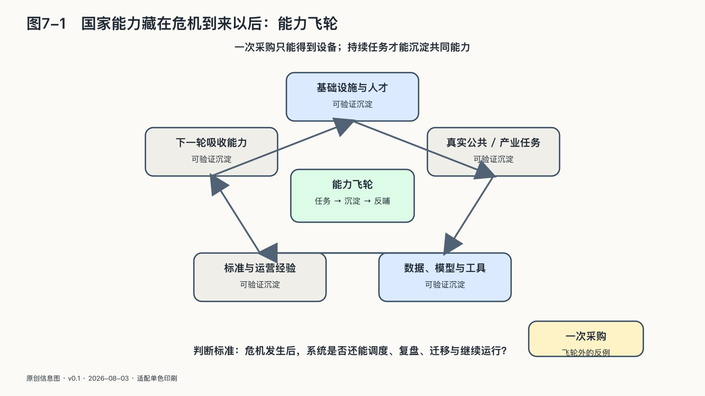

## 国家能力藏在危机到来以后

智能基础设施由一条长链构成。

芯片依赖设计工具、制造设备和材料；算力依赖能源、网络和冷却；模型依赖数据、软件与人才；应用依赖云、接口、身份和支付；公共服务还依赖采购、法律、档案、审计和基层执行。

面对这条长链，国家最容易犯两个相反错误。

一个错误是假装依赖不存在，只看最终系统能不能运行。平时一切顺利，合同到期、价格变化、供应中断或安全事故发生时，才发现数据带不走、接口无人理解、备用方案从未测试。

另一个错误是把所有依赖都当成失败，试图在每一个环节重复建设。这不仅成本巨大，还可能让资源从真正关键的能力上分散，最终得到许多项目，却缺少持续维护和演进的人。

国家能力首先表现为分得清轻重。

一项娱乐服务短暂停止，与医院、支付、通信或能源调度同时中断，不是同一种风险；办公辅助依赖一家模型，与公共身份、档案和核心决策依赖一个不可替代接口，也不是同一种风险。

公共部门需要绘制关键依赖图，避免把它变成一张用于指责采购来源的“依赖羞耻表”。图上应标出哪些功能中断后会触及基本秩序、依赖经过哪些组织和技术节点、能够承受多久、替代路线需要什么，以及谁负责定期演练。

第二条路不一定是复制一整套系统。它可以是多家供应、开放格式、自持关键密钥、可移植数据、保留人工流程、区域互助，或者在危机时只能提供核心功能的降级模式。

机场在系统故障时不需要立刻恢复所有商业服务，但必须继续保障飞行安全；医院不需要让每个智能功能都在线，但要能找到病历、确认身份、开出必要医嘱；政府服务门户无法使用时，必须让急需救助的人还有入口。

降级不是失败。没有想过怎样降级，才是脆弱。

真正的国家能力也藏在迁移工程里。很多机构有“可以导出数据”的合同条款，却从未把数据导入另一套环境；有备用系统，却共享同一身份服务、同一网络和同一运维团队；有开源代码，却没有人能独立部署、修复和升级。

选择权只有经过演练才算存在。

### 不要用一次模型领先替代长期国家能力

模型榜单最容易吸引国家战略的注意。第一名清楚、醒目、便于传播，也很容易被误当成整个AI体系的成绩单。

但模型领先具有阶段性。二〇二五年以来，来自不同公司和国家的头部模型多次交换位置；论文、开放权重、蒸馏、量化和工程经验又会把部分前沿能力快速扩散到更多模型。今天在一项基准上领先，不保证明年继续领先；今天落后三个百分点，也不等于整个产业永久失去机会。[^p2-moving-frontier]

这并不意味着先发优势无关紧要。前沿训练需要资本、芯片、能源、高质量数据、人才密度和大量失败实验；真实部署还需要云、渠道、安全、评测与持续运维。容易扩散的是已经被证明的能力，较难扩散的是持续制造下一次突破并把它稳定运行起来的组织体系。

国家战略不能只追逐参数表或总分，还要建设吸收能力：理解外部进展、独立评测、合法取得并改造开放成果、把新模型接入本地语言和真实行业、在供应变化后迁移任务，并让大学、企业、公共机构与开发者共同积累经验。

具备这些能力的国家，在某些阶段可以不训练全球最大的通用模型。稀缺资源可以投入关键算力底线、公共评测、语言数据、开放工具、科研设施、人才和高价值应用，同时购买或合作使用外部前沿能力。部分环节可以外购，理解、判断、适配和退出能力需要留在本地。

榜单可以提示短期变化，无法代表完整的工业体系。技术路线变化后，一个社会能否继续学习、比较和组合新的能力，比某个模型维持多久的第一名更能说明持续性。
