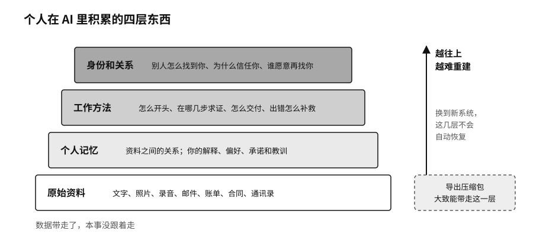

## 带不走的那部分

把一个 AI 账户里的数据完整导出来，通常并不难。压缩包里有几千段对话、附件和时间戳，一份不少。可把这些材料放进另一套系统，原来的工作并不会自动恢复。新系统不知道哪些是长期的偏好，哪些事已经办完，哪些结论后来被推翻了。

数据带走了，本事没跟着走。

一个人在 AI 里积累的东西，大致分四层。最底下是原始资料：文字、照片、录音、邮件、账单、合同、通讯录。往上一层是个人记忆，也就是这些资料之间的关系，以及你自己的解释、偏好、承诺和教训。再往上是工作方法，一件事怎么开头、在哪几步要求证、怎么交付、出了错怎么补救。最难重建的是最上面一层，身份和关系：别人怎么找到你，为什么信任你，哪些客户愿意再找你。

AI 可以同时进入这四层。全都放进同一个产品里，用起来非常顺手，不用反复解释，也不用到处翻找。代价是，哪天要离开，就不只是换一个软件，而是要把自己重新教一遍。

### 机器记住的你

记忆型 AI 很容易让人着迷，它记得你不吃香菜，也记得你半年前说过想写一本书。可机器的记忆和人的记忆不一样。人会遗忘，会改变，也会对不同的人说不同的话：对医生讲身体，对朋友讲脆弱，对家人讲牵挂。机器倾向于把所有记忆都存成可以检索、关联和调用的条目，原来说这句话时的情境却丢了。深夜情绪低落时随口说的一句话，几年后可能被当成你稳定的偏好。

陪伴类应用 Replika 是一个例子。它让用户创建一个虚拟角色，当知己、当心理咨询师，或者当恋人。关系越深，用户交出去的情绪、健康和亲密关系信息就越多。二〇二五年，意大利数据保护机构对 Replika 的运营方 Luka 公司罚款五百万欧元。监管机构认定，截至二〇二三年二月，这家公司处理这些数据缺乏合法依据，隐私说明有多处不足，也没有真正核验用户年龄。[^p4-replika] 产品用"它懂你"建立了亲密感，后台连最基本的告知和未成年人保护都没做到。

还有一种数据更容易被忽视，就是系统从你的资料里推断出来的东西。美国联邦贸易委员会调查过一个叫 Everalbum 的相册应用。这家公司曾告诉部分用户，只有主动开启才会对照片做人脸识别，还承诺账户停用后删除照片。监管材料显示，实际上一些用户的人脸识别是默认开启的，停用账户的照片也被长期保留；公司还从用户照片里提取了人脸特征，用来开发自己的识别技术。二〇二一年的和解协议不仅要求删除照片和人脸特征，还要求删除用这些材料开发出来的模型和算法。[^p4-derived-data]

一段日记是你写的，系统给它打上的情绪标签、性格推断和人际关系摘要，同样会影响以后推给你的东西。你可以删掉原文，那些标签却可能一直留着。

所以对个人记忆，我建议守住三条线。一是时间：事实会过期，偏好会改变，旧信息应该被更新或忘掉。二是场合：工作助手知道的事，不该自动流到健康助手那里；家里的记录也不该默认进入商业任务。三是解释：AI 可以说"你好像更喜欢 A"，却不能把这个推断当成事实，更不能让一次推断永远决定你以后能看到的选项。
