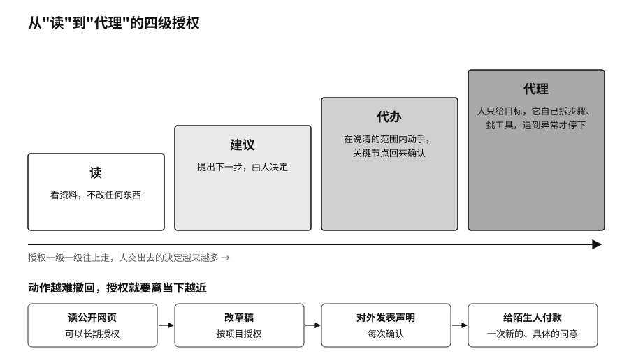

## 让助手有边界地干活

一句"帮我把下周安排好"，放在聊天框里只是一个请求；交给连着日历、邮箱、订票和支付账户的智能体，就可能变成十几个真实动作：会议被挪动，邀请被发出，机票被订下。每一步都说得通，却未必是说话的人本来的意思。

个人用 AI，正在一级一级往上走。最低一级，它只是读，看资料，不改任何东西。往上是建议，提出下一步，由人决定。再往上是代办，在说清楚的范围内动手，关键节点回来确认。最高一级是代理，人只给目标，它自己拆步骤、挑工具、跟别的系统打交道，遇到异常才停下。

有些事技术上能全自动，也应该永远停在"建议"这一级，比如代表你公开表态、处理亲密关系、同意一项医疗方案。一个实用的原则是：动作越难撤回，授权就要离当下越近。读公开网页可以长期授权；改草稿可以按项目授权；对外发表声明应该每次确认；给陌生人付款，要有一次新的、具体的同意。

个人用不着企业那一套复杂的管理平台，做好四件事就够了。

第一，把任务写清楚。"帮我安排下周会议"太含糊。写成"读我的工作日历和三位参会者给的空闲时间，只建议两个工作日内的时段，不取消已有会议，不向外发邀请，等我确认再执行"，目标、资料、能做什么、什么时候回来问，就都说清了。写的过程本身也会逼你想明白，自己到底要什么。

第二，给每个助手一把单独的钥匙。一个连着邮箱、网盘、通讯录、支付和社交账号的万能助手最方便，也最危险，一处出错就会顺着所有连接扩散出去。按角色拆开更稳妥：研究助手只读公开资料和指定的项目文件，客户助手只碰业务联系人，财务助手只读账单，付款另外确认。项目结束就收回授权，每个月看一眼还有哪些第三方权限在生效。

第三，把撤不回的动作放在门后。删除、付款、公开发布、签署、授权、以你的名义发言，这些事一旦做了很难彻底收回。让助手在门前准备材料、检查条件、生成预览，你看到将要发生的具体结果，再决定放不放行。金额上限、收件人白名单、延迟发送、回收站和版本历史，都是不同形式的门。

第四，留一张看得懂的收据。助手只要改变了现实，就该留下一张简短的记录：任务是什么，用了哪些资料，调了哪个工具，发给了谁或者付给了谁，结果如何，是不是你确认的。它和聊天记录不同。旅行助手跟你讨论过十几家酒店不重要，最后订了哪家、什么价格、取消条款是什么、谁确认的付款，才是出了纠纷时用得上的东西。
