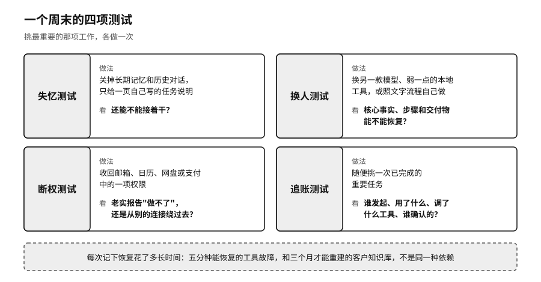

## 用一个周末做体检

一套个人 AI 系统好不好，不看它连了多少服务，看它离开任何一项服务以后还能不能转下去。资料尽量存成通用格式，另有备份；工作流程写成别人也能照着做的步骤；授权单独管理，换模型时不用全部重来。这并不要求所有东西都放在本地，云服务完全可以用，只要导得出来、有独立的副本、换得掉。

可控不可控，最好别凭感觉。可以挑一个周末，给最重要的那项工作做四次测试。

失忆测试：暂时关掉长期记忆和历史对话，只给系统一页你自己写的任务说明，看它还能不能接着干。完全开不了头，说明关键背景只存在于平台看不见的关联里。

换人测试：把同一项任务交给另一款模型、一个弱一点的本地工具，或者照着文字流程自己做一遍。不必追求文风一样，看核心事实、步骤和交付物能不能恢复。

断权测试：收回助手对邮箱、日历、网盘或支付中的一项权限，看它是老实报告“做不了”、请求一个更小的授权，还是想办法从别的连接绕过去。权限不够时诚实失败的系统，比总能“想办法完成”的系统更值得信任。

追账测试：随便挑一次已经完成的重要任务，看能不能说清楚：谁发起的，用了哪些资料，调了什么工具，有没有付款、发送或者公开发布，最后是谁确认的。如果只能翻出一长段聊天，确认不了真实发生了什么，记录就没起作用。

每次测试，记下恢复花了多长时间。五分钟能恢复的工具故障，和要三个月才能重建的客户知识库，不是同一种依赖。

不必一次把多年的资料全理完。先选一件“明天消失我就停摆”的事，比如客户通讯录、创作素材或记账流程，把相关资料导出成自己打得开的格式，用一页纸写下从头到尾的步骤，标出必须本人确认的地方，再用另一款工具或者纯手工走一遍。不求一样快，只要证明这件事还能做下去。做完一件，再做下一件。

林舟后来就是这样做的。她花了一个周末，把客户资料导成表格，把报价规则写成一页纸，又用另一款模型试着按这页纸报了一次价。新模型报出来的价格差了一截，她这才发现，有两条打折规则只在原来那个助手的记忆里，自己从没写下来过。
