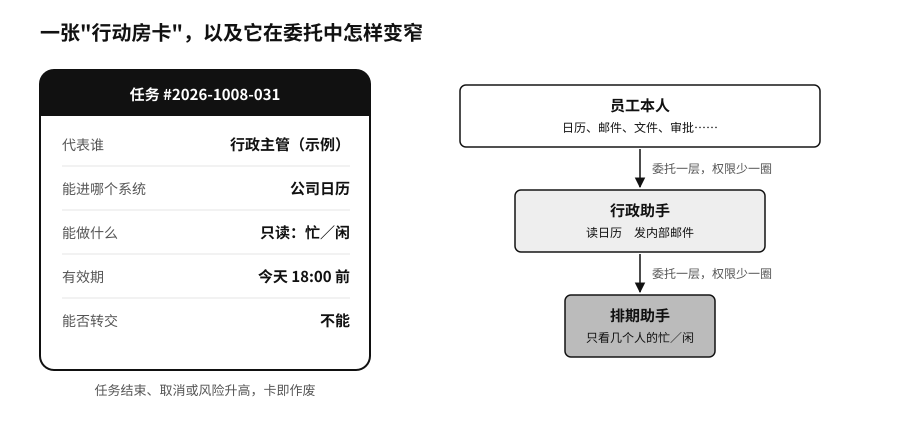
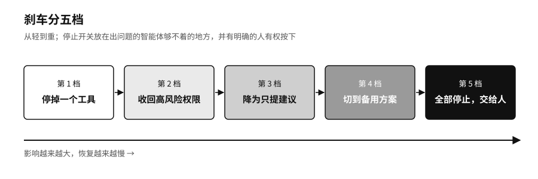

## 最小权限：行动房卡与刹车机制

数据管住了，还要管机器能动手做什么。

最常见也最危险的做法，是把员工自己的账号，甚至公司级的管理密钥，直接交给智能体，智能体再转手交给下一个智能体。出了事查日志，只能看到“某员工账号执行了操作”，至于是员工本人、主智能体、子智能体，还是一段藏在邮件里的恶意指令触发的，日志说不清楚。

酒店的房卡是个好参照。订了房的客人拿不到整栋楼的总钥匙，房卡只开指定的那间房，退房当天就失效。智能体每接一项任务，也可以领这样一张卡，卡上写明它代表谁、能进哪个系统、能做哪些操作、有效期到哪天、能不能转交给别人。任务做完、被取消或者风险升高，卡就作废。

任务往下派一层，卡上的权限就应该少一些。比如行政助手可以读负责人的日程、可以给同事发邮件，它把“找一个大家都有空的时间”交给排期助手。排期助手只需要知道几个人在某几天忙不忙，会议标题它不必看，发邮件的权限更不该带过去。

技术标准已经开始这样写。截至二〇二六年八月，第二章提到的模型上下文协议（MCP）的授权规范明确规定，不能把客户端拿到的令牌（证明身份和权限的一串临时凭证，像一张限时门禁卡）原样转交给下游服务。[^p9-mcp-control] 美国国家标准与技术研究院（NIST）下属的国家网络安全卓越中心也在二〇二六年二月发布概念文件，就智能体的身份认证、最小权限和“代表他人办事”的授权委托公开征求意见。[^p4-nist-agent-id]

光有房卡还不够，还得有一张写清楚的任务单。“帮我处理客户投诉”只是一句话。要变成机器能执行的任务，至少得说明几件事：做到什么程度算完，由谁验收；可以看哪些资料，哪些资料已经过期；能用哪些工具，金额和次数上限是多少；遇到规则冲突、预算用完或者马上要做一件撤不回来的事情时，停下来找谁。

任务单不必规定每一步怎么走，智能体的用处就在于能自己找路。任务单规定的是它不能越过的线。它可以比较十条出差路线，付款却有上限；它可以标出一笔可疑交易，冻结客户账户要等人来决定。

房卡管的是有没有资格，管不了做得对不对。一张最多只能付一千元的卡，照样可能付给错误的收款人。所以刹车要在上线以前装好。

大多数 AI 项目立项时，先写的是成功指标：省多少时间，多赚多少钱，少用多少人。我们建议先写一页失败说明：这件事最不能出的错是什么，一次出错最多会波及多少人，哪些资料绝不能交给模型，哪些操作必须有人复核，外部服务断了，业务能撑多久。能不能上线，要看最坏的情况有没有想清楚。

上线也可以分几步。先拿历史任务离线试，再让它在真实流程旁边只看不动手，然后放一小部分低风险的业务给它。每多给一项权限，就多要一份测试证据，同时准备好退回去的办法。

真出了错，先停下来，别急着重试。一个智能体提交订单时超时了，它不知道订单是根本没建成，还是建成了只是回执丢了。再提交一次，可能就重复下了单。一个群发邮件的任务在第六十七封时断了，前面六十六封已经发出去，撤不回来。查天气的请求可以随便重试，付款和发信就得先查清楚真实状态。有些事只能事后补救，包裹去拦截，多扣的钱去退款，发错的通知去更正、道歉。

刹车最好分几档：先停掉一个工具，再收回高风险的权限，再把它降成只能提建议，再切到备用方案，最后整个停掉、交给人处理。停止开关要放在出问题的智能体够不着的地方，而且要有一个确实有权按下它的人。如果员工在屏幕上只看得到“风险分七十八”，看不到原始材料；或者他可以表示反对，却改变不了任何结果，那么所谓“有人把关”，只是把责任推给了这个人。

做模型的公司自己也不敢在这件事上打包票。二〇二六年十月五日，纽约市议会全体议员就 AI 风险举行听证，OpenAI、Anthropic、谷歌和 Meta 的代表到场。议长要求他们保证自家的智能体始终遵守安全防护，四家都没有给出保证。议长办公室提出的约十项法案里，有一项就是要求配备由人掌握的停止开关。[^new-nyc-hearing]

