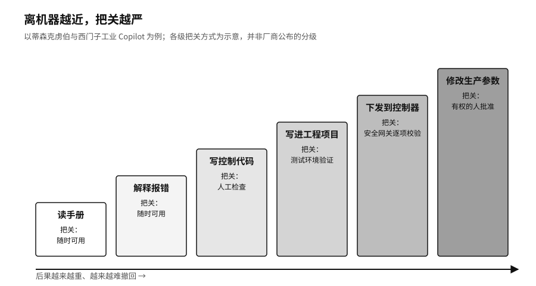

## 先停在草稿

骑士资本出事十一年后，摩根士丹利（Morgan Stanley，美国大型投资银行）开始在财富管理业务里用生成式 AI。它选的起点很保守。

二〇二三年推出的第一个工具，只帮理财顾问在公司内部的研究资料里找答案。它不碰交易，也不直接跟客户说话。二〇二四年推出的 Debrief 往前走了一步，处理客户会议记录。客户点头同意后，系统才开始整理笔记、待办事项和邮件草稿。邮件写好了，要由持牌顾问修改，发不发也由顾问决定。[^p6-morgan-stanley]

底层模型来自 OpenAI。摩根士丹利在自己手里留下的，是另外一些东西：这个工具能用在哪些场合，读哪些资料，上线前怎么测，客户有没有同意，邮件最后由谁按下发送。美国金融业监管局（FINRA，美国券商行业的自律监管机构）后来专门发文提醒：不管是自己开发还是用第三方的生成式 AI，券商都要照常遵守现有规则，上线前要先评估，把 AI 用在监督流程里时，还要管住模型的可靠性和准确性。[^p6-finra-genai]

这家银行并非不知道模型可以做得更多。它让 AI 停在草稿这一步，是因为再往前走，就需要更多的证据和更可靠的刹车，而这些它还没有准备好。

工厂里的做法又不一样。二〇二四年，蒂森克虏伯（thyssenkrupp，德国工业集团）和西门子（Siemens）合作，把工业 Copilot（西门子与微软合作开发的工业 AI 助手）用在电动车电池的质检设备上。系统帮工程师更快写出设备控制器（PLC）的控制代码，放进西门子的工程软件 TIA Portal 里。在西门子自己的埃尔朗根电子工厂，焊锡设备报错时，它能把报错代码翻译成大白话，并给出处理建议。[^p6-industrial-copilot]

模型写的代码不会直接进机器。西门子的设计在模型和设备控制器之间加了一道关口，代码要先按机器状态、安全联锁、操作员权限和工厂规则逐项过一遍。模型更新了，要先在虚拟环境里调试，再新旧两套并行、逐步切换上线。

在这家工厂里，读手册、解释报错、写代码、把代码写进工程项目、下发到控制器、修改生产参数，后果一个比一个重。工厂给每一步配的门也一道比一道窄。

