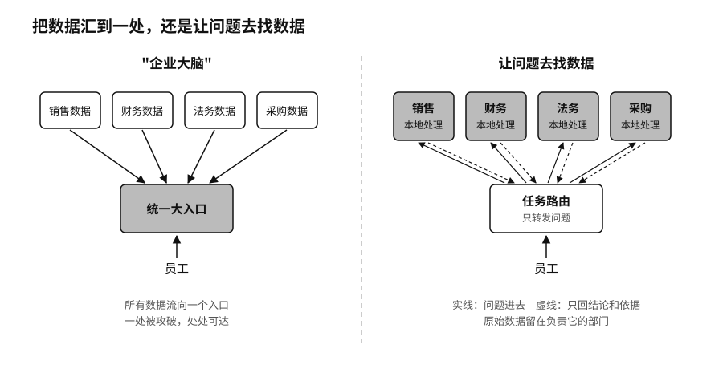

## 企业大脑的诱惑

很多公司建 AI 系统时，都会被同一个想法吸引：把全部邮件、文档、数据库和会议记录汇到一起，让员工在一个对话框里问整家公司。有人管它叫"企业大脑"。

这种系统演示起来很漂亮。销售问一句"这个客户能不能给折扣"，系统马上调出往来邮件、历史订单、产品毛利和合同里的风险条款。销售、财务、法务、客服四个部门原本各有门禁，在这一刻被合并成了一个入口。

麻烦随之而来。这个入口能替用户进所有系统，混进来的一段恶意文字也能顺着它走遍全公司。法务说"风险可接受"，财务说"收入已确认"，销售说"这单大概率能成"，三句话的把握程度差得很远，被搅进同一个答案后，读的人分不出来。答案出了错，每个部门只能解释自己那一段。公司换一次模型，招聘、报价、采购和合规的判断可能同时跟着变。

谷歌在大模型出现以前就碰到过类似的问题。二〇一四年，它公开了一套叫 BeyondCorp（意为"超越公司内网"）的内部安全做法：员工连上公司内网，并不因此自动获得信任，每一次访问都要按这个人是谁、用的是什么设备、要做什么重新判断。[^p5-beyondcorp]

用 AI 时可以再往前走一步：让问题去找数据，数据留在原处。销售想知道客户的信用情况，请求送到财务部门，财务在自己的系统里查完、算完，只交回结论和必要的依据。招聘系统只需要知道候选人是否满足某项资格，用不着整份人事档案。法务交回"可以发布""需要修改""需要上报"三种结论之一，附上依据和有效期，案卷本身不出法务部。要停掉一个供应商，就把请求交给采购部，由采购用自己的系统去停，采购系统的密码不交给任何人。

这样做，每份数据仍由对它负责的部门看管。

部门交回的答案，含义也要写清楚。销售系统里的"客户"往往包括还在跟进的潜在客户，财务系统里的"客户"只算已经成交的。两个字段都叫 customer，混在一起统计，经营报告的第一行就是错的。网约车公司 Uber 的数据分析平台管着一百多 PB 的数据，他们后来定下一条规矩：数据要像代码一样对待，每份数据都要有明确的负责人和明确的用途，配好文档，没用了就下线。[^p5-uber-data-quality]
