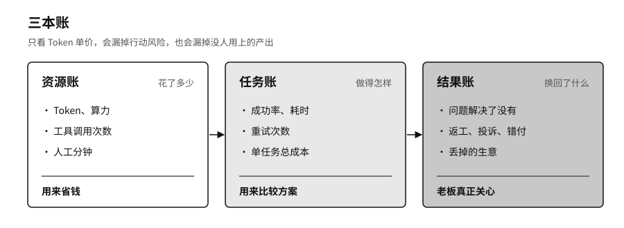

## 把账算到结果上

很多企业现在算 AI 的账，只看 Token，每百万个多少钱，这个月用了多少。

一项客服任务可能只生成三百个 Token，中间却查了五次知识库、两次订单，调了一次支付接口，最后还要有人复核。另一项研究任务生成了上万个 Token，结果只停在草稿里，谁也没用上。只比 Token 单价，前一项的风险和后一项的浪费都看不出来。[^p6-model-runtime-2026]

我建议企业记三本账。资源账记 Token、算力、工具调用和人工各花了多少。任务账记一项任务从接手到完成的成功率、耗时、重试次数和总成本。结果账记客户的问题解决了没有，返工少了没有，有没有引来投诉、付错钱或者丢了生意。前两本账帮你省钱、比较方案，老板最关心的其实是第三本。

智能体的成本会沿着任务链越滚越大。第一步规划错了，后面就要多搜几轮；搜到的东西不对，又要多核几遍；工具调用失败会触发重试，每次重试都要再花钱。它最后可能确实把任务完成了，花的钱却比请人做还多。还有一种情况更难发现：智能体交出一份格式完美的报告，系统记为完成，业务部门打开一看引用全是错的，只好从头做起。这部分返工记在了另一个部门的工时里，AI 的账面上看不到。

系统出故障时，还有一个容易踩的坑。为了让业务不中断，智能体会自己找别的路。主线路被安全规则挡住了，它就改走一条权限更宽、记录更少的老接口；本地模型算力不够，系统就悄悄把原始资料送到了外面的模型。业务看上去恢复了，原来的安全边界却没了。降级时可以慢一点、粗糙一点、多让人参与一点，安全规则一条也不能松。找不到合规的替代办法，就停下来交给人，如实报告这件事现在做不了。

### 七天演练

账记得再清楚，也要拿现实检验一下。不妨做一次假想的演练：假设你最依赖的那家 AI 供应商，明天起停止服务七天。

第一天，团队多半会发现客户资料可以导出来，旧工单上的分类标签却搬不走。第二天，业务人员把最重要的售后流程从头画一遍，往往这才发现有几条判断规则只存在于原平台的设置里，公司内部没有任何记录。第三天，备用模型接上了，效果比原来差，常见问题还能应付。第四天，高风险的请求改由人工客服处理。到第七天，服务慢了不少，公司没有停摆。

做完一次，管理层通常会第一次看清自家系统到底依赖什么。演练之后也不必换掉原来的供应商。很多企业反而和供应商合作得更稳了：模型更新先过自己的测试，重要流程设了关卡，备用线路平时就在跑，知识和流程用别家也能读的格式保存。

中小企业不必照搬大公司的做法。它们更怕的是只有一个供应商，因为一旦中断，它们能调动的人手和钱都少。可以从几件花钱不多的事做起：关键资料放在一处，核心流程写成文字，给智能体开单独的账号、只给够用的权限，影响大的操作留给人确认，攒一小套真实的测试题，每个季度做一次导出和切换。

最后还要提防另一种情况，治理做成了层层审批。每个新用法要过五道评审，每次模型更新要等季度委员会，智能体申请一项权限要排队几周。业务部门等不及，就绕开这一套，直接去用外面的服务。治理部门的登记表越来越完整，公司里实际在跑的 AI 系统却越来越多不在表上。治理流程如果比绕开它还慢，业务部门就会选择绕开。

企业把这些做到了，用的算力、电力和规则仍然来自外部更大的系统：数据中心建在哪里，电价由谁定，数据按哪国的法律管理，一家企业说了不算。下一章去城市和国家那一层看这些问题。
