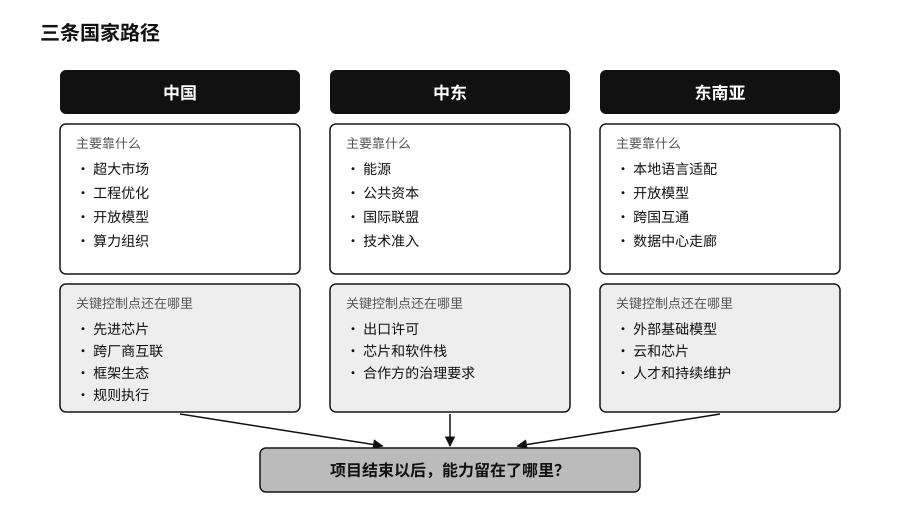
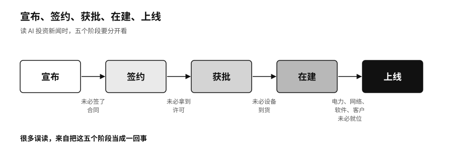

## 国家路线：中国、中东与东南亚的三种打法

各国的资源禀赋不同，走的路也不一样。中国靠的是超大的市场、工程能力和开放模型；中东把能源、资本和技术准入组合在一起；东南亚更看重本地语言和跨国合作。三条路的起点不同，最后都要回答同一个问题：项目结束以后，能力留在了哪里。

### 中国：在受限的算力上

第二章讲过 DeepSeek-R1 怎样震动了美国股市。这家公司的技术路线，比“追上了”或“摆脱了”这类简单说法复杂得多。

二〇二二年到二〇二五年，美国多次收紧先进计算芯片和半导体制造设备的出口管制，中国团队取得前沿算力的条件越来越难。[^p7-bis-compute] 深度求索在 DeepSeek-V3 的技术报告里写明，模型是在英伟达 H800 芯片集群上训练的。H800 是英伟达为符合出口规定、专门给中国市场做的降级版本。V3 总共约六千七百一十亿个参数，处理每个 Token 时只用到约三百七十亿个；报告披露，完整训练消耗了约二百七十八点八万个 H800 GPU 小时（一张芯片运行一小时记为一个 GPU 小时）。[^p7-deepseek-path] 这个数字只覆盖报告里描述的那一次训练，不包括前期的架构探索、失败的实验和后来 R1 的训练，不能被理解成“做一个前沿模型只要这么多钱”。它说明的是另一件事：算力不够用的时候，团队会想方设法让每一份算力产出更多能力。

深度求索的成果也离不开全世界。V3 用的是美国设计的芯片，R1 的蒸馏版本建在阿里巴巴的通义千问和 Meta 的 Llama 之上，部署依赖全球的开源工具。外部的限制、全球的相互依赖、工程上的效率和开放带来的扩散，同时存在于这一条技术路线上。

国产芯片也在追赶。二〇二六年四月深度求索发布 V4 当天，华为昇腾、寒武纪、海光、平头哥、摩尔线程、沐曦、昆仑芯和天数智芯八家国产芯片宣布完成适配，发布当天就能部署，不用再等几周做软件移植。两个月后，深圳河套学院等单位的团队报告，用一千多张华为昇腾 910C 芯片，对一万六千亿参数的 V4-Pro 完成了一千五百多步的全参数后训练，称全程零中断。[^p7-ascend-day0] 这说明生态响应快了，还不能证明长期运行已经稳定，跨厂商芯片的互联也还需要独立测试来验证。

中国的规模提供了大量学习机会。截至二〇二五年十二月，中国生成式 AI 用户约六亿零二百万，普及率约百分之四十二点八，七百四十八款生成式 AI 服务完成了备案。[^p7-china-scale] 制造、能源、医疗、金融这些行业有海量的真实任务，可以产生需求、反馈、测试场景和工程人才。但如果行业知识只沉淀在少数几个平台里，企业带不走自己的测试题和反馈，超大的市场也可能变成超大的锁定。

中国的 AI 主权还有另一面：国家和平台怎样使用 AI。《个人信息保护法》第二十四条规定，自动化决策作出对个人权益有重大影响的决定时，个人有权要求说明，并有权拒绝仅通过自动化决策作出的决定。[^p7-china-governance] 正式的规则已经有了，执行是否一致、解释是否具体、申诉的门槛够不够低，还要看实际运行。一个国家要防止社会受制于外部平台，也要防止公民受制于本国的机构和平台。

### 中东：能源、资本和准入

中东的 AI 新闻里，最常见的是巨额投资和数据中心容量。读这类新闻，要把宣布、签约、获批、在建、上线五个阶段分开看，很多误读都来自把它们当成一回事。

阿联酋的起点并不是数据中心。阿布扎比技术创新研究所（TII）先后发布了 Falcon（“猎鹰”）系列开放权重模型，二〇二五年又推出了面向现代标准阿拉伯语和地方方言的 Falcon Arabic。[^p7-uae-falcon] 有了自己的研究机构和训练经验，阿联酋就多了一个不完全依赖外国聊天接口的起点。

沙特走的是另一条路。沙特数据与人工智能管理局先把国家数据管理、国家人工智能中心和国家信息中心整合进一个公共体系，开发了阿拉伯语模型 ALLAM。ALLAM 的多数版本是在 Meta 的 Llama 2 基础上继续训练的，只有一个七十亿参数的版本从零训练。[^p7-saudi-allam] 它的“国家属性”体现在阿拉伯语数据、调优目标、政府应用入口和本地的组织能力上。二〇二五年五月，沙特公共投资基金（PIF）成立了 HUMAIN 公司，把数据中心、云、模型、应用和硬件采购集中到一家国有运营公司，随后与英伟达、AMD、亚马逊云、谷歌等多家企业合作。[^p7-saudi-humain] 多找几家供应商，降低了对单一公司的依赖，共同的瓶颈却还在：截至二〇二五年十一月，美国商务部明确批准给 HUMAIN 的芯片规模，同样是相当于最多三万五千颗 GB300。[^p7-gulf-export]

阿联酋和沙特都没有把目标定成自己造每一颗芯片，而是让模型为谁服务、数据流向哪里、算力怎么调度，都留在本国能够谈判、能够问责的范围里。

### 东南亚：把依赖关系设计好

东南亚的处境又不一样。几百种语言分布在十多个国家，全球的大模型很容易进来，本地的语言和文化却未必被认真对待。

新加坡二〇二三年启动了七千万新元的国家多模态大模型计划，由 AI Singapore 开发的 SEA-LION 不追求复制世界最大的通用模型，而是专门覆盖东南亚语言，也照顾到新加坡式英语、马来西亚式英语这类英语和本地语言夹杂的说话方式，后来又在 Llama、Gemma、通义千问等开放模型的基础上继续训练。[^p7-sealion] 一句话里混着英语和本地语言，对全球模型来说是很难的输入。谁收集语料、谁设计测试、谁来定义什么算错，谁就在定义这片地区的现实怎样被机器理解。印度尼西亚的 Sahabat-AI 更进一步，覆盖了印尼语、爪哇语、巽他语、巴厘语和巴塔克语。[^p7-sea-adapt]

越南的故事提醒人们，模型留下了，团队未必留得下。二〇二三年，越南科技公司 VinAI 从头训练了约三十七亿参数的越南语模型 PhoGPT，用了约一千零二十亿个越南语 Token，并以宽松的开源许可证公开了代码和权重。[^p7-phogpt] 二〇二五年四月，美国芯片公司高通（Qualcomm）收购了 VinAI 的研究和生成式 AI 团队，VinAI 在 Hugging Face 上的页面随后注明不再更新。权重还在，任何人都可以拿去继续改，原来那支知道怎么训练下一版的团队却已经换了东家。

算力也在把东南亚连成一片。东盟二〇二五年底的数据中心发展指南记录，新加坡已有超过一点四吉瓦的数据中心在运行，土地和电力紧张，新增需求开始外溢到对岸的马来西亚柔佛州和印尼巴淡岛。[^p7-asean-dc] 机房分散到了区域各处，控制权却未必跟着分散，很多项目仍由全球云厂商建设。

东盟没有用一个区域超级数据库来应对。东盟单一窗口（ASEAN Single Window）已经让十个成员国的海关系统按共同标准交换原产地证书和报关文件，各国保留自己的系统，只在接口上互通。[^p7-asean-rules] 资源有限的国家，主权更多来自对依赖关系的设计：接口怎么定，规则怎么写，退路怎么留。

| 路径 | 主要靠什么取得能力 | 关键控制点还在哪里 | 能力怎样留在本地 |
|---|---|---|---|
| 中国 | 超大市场、工程优化、开放模型、算力组织 | 先进芯片、跨厂商互联、框架生态、规则执行 | 训练和部署人才、开放模型的衍生、行业应用、可申诉的制度 |
| 中东 | 能源、公共资本、国际联盟、技术准入 | 出口许可、芯片和软件栈、合作方的治理要求 | 本地运营团队、数据和场景、多供应商编排、长期维护 |
| 东南亚 | 本地语言适配、开放模型、跨国互通、数据中心走廊 | 外部基础模型、云和芯片、人才和持续维护的组织 | 语言数据、测试集、区域协议、能延续下去的团队 |
