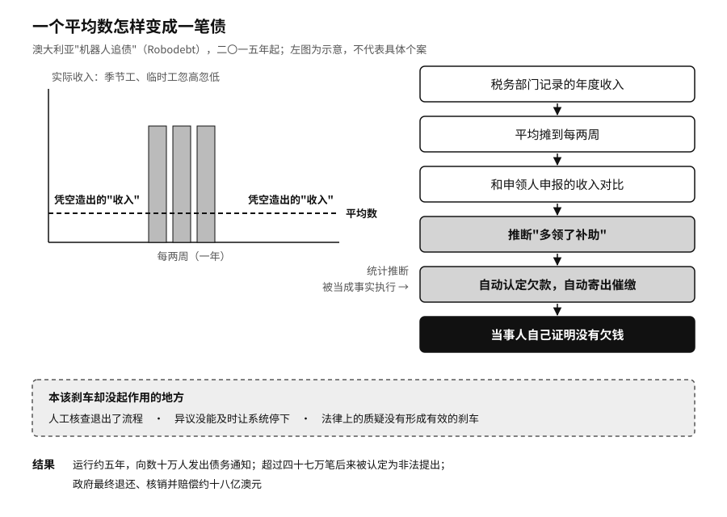

## 被机器追债的人

二〇一五年，澳大利亚政府启动了一项自动追讨福利多发款的计划。过去要人工逐案核查，现在由系统自动比对数据、自动认定欠款、自动寄出催缴通知。公众后来管它叫“机器人追债”（Robodebt）。

系统的做法是，把税务部门记录的年度收入和福利申领人申报的收入对比，再把年收入平均摊到每两周，据此推断某些人曾经多领了补助。对工资稳定的人，平均数也许接近实际；对季节工、临时工和收入忽高忽低的零工，平均数会凭空造出一段从未存在过的“收入”。

一个统计推断，进了追债流程以后，就被当成了事实来执行。很多人收到通知，要自己证明没有欠钱。政府握着数据、规则和催收手段，普通人却要去解释一笔连计算过程都看不懂的债务。人工核查退出了流程，异议没能及时让系统停下，法律上的质疑也没有形成有效的刹车。

这个计划运行了约五年，向数十万人发出债务通知，其中约四十七万笔后来被政府承认为非法提出。政府在二〇二一年的和解中退还、核销并赔偿了约十八亿澳元；二〇二六年六月，法院又批准了一笔五亿四千八百五十万澳元的新和解。二〇二三年，皇家调查委员会发布报告，建议政府的自动化决定要有统一的法律框架、清楚的复核途径、通俗的系统说明，业务规则和算法要能接受独立专家审查，还要有机构持续监测和审计它们的影响。[^p7-robodebt]

一个更准确的模型，同样可能去执行一项没有充分法律授权的政策，同样可能用不适合个案判断的数据，同样可能把人困在申诉无门的流程里。准确率回答的是系统多常猜对。公共机构还得回答：它有没有权去猜，猜错了谁来承担，被猜错的人怎样拿回自己的权利。一个影响一百万人、准确率百分之九十九的系统，仍然可能让一万人陷入错误。

荷兰的 SyRI 系统走到了法院。这套系统把政府掌握的多类数据拼在一起，用来识别福利、补贴和税务欺诈的风险。二〇二〇年，海牙地区法院认定，相关立法没能在公共利益和私人生活之间保持公平的平衡，违反了《欧洲人权公约》第八条。[^p7-syri] 各个部门各自合法掌握的数据，一旦被重新拼接和筛查，就形成了一种新的权力，必须重新证明它的必要性、透明度和适度性。

一个收到不利决定的人，首先需要三个朴素的答案：依据了什么事实，哪一条规则影响了我，怎样才能让一个有权改变结果的人重新看一遍。提出异议以后，材料要送到一个看得到原始证据、也有权推翻系统结论的人手里，而不是让原来的程序再跑一遍。申诉渠道还得对真实的人可用。一个需要稳定网络、复杂证明和专业术语的在线入口，会把老人、残障人士、少数语言群体和身处危机的人挡在外面。

公共机构还得记得自己做过什么。五年以后，一个公民追问当年的资格为什么被取消，机构不能只拿出今天的模型版本，更不能回答“那位项目负责人已经离职了”。加拿大要求相关的政府项目在设计初期和投产前做算法影响评估，系统功能或范围变了还要更新；[^p7-canada-aia] 英国用统一的格式公开政府部门怎样使用会影响公众的算法工具，到二〇二五年五月，已经公布了五十九份这样的记录。[^p7-uk-atrs] 这些制度不能保证机器不出错，但让社会知道了机器的存在，也让改过的系统没法躲在第一次审批后面。

经合组织二〇二六年调查了三十六个成员国，只有十个国家报告对政府的 AI 应用做过影响测量。[^p7-oecd-government-impact] 政府购买 AI 的速度，快过了证明这些 AI 有没有用的速度。
