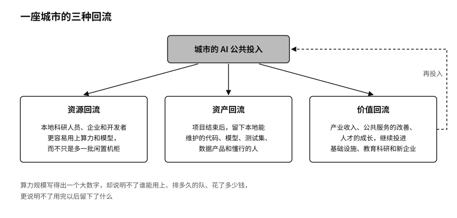

## 城市：把算力变成生态

国家管的是供应安全、法律底线、国际合作和长期投入，这些能力最后都要落到具体的城市。一座城市颁发不了芯片出口许可，也建不起完整的全球供应链，但机房接什么电、大学培养什么人、医院和工厂愿意开放哪些问题、公共数据怎样授权、开发者去哪里找模型、创业团队怎样拿到第一笔算力，几乎都在城市这一层发生。

城市之间的 AI 竞争，第一阶段比的是机柜数量、补贴力度和招商名单。这个阶段正在过去。下一阶段要看的是，开发者愿不愿意把项目留在这里，企业离开补贴以后还待不待得住。

一座城市的 AI 投入有没有变成能力，可以看三种回流。资源回流：公共投入有没有让本地的科研人员、企业和开发者更容易用上算力和模型，而不只是多了一批闲置的机柜。资产回流：项目结束以后，有没有留下本地能维护的代码、模型、测试集、数据产品和懂行的人。价值回流：产业收入、公共服务的改善和人才的成长，有没有继续投进基础设施、教育科研和新的企业里。

算力最容易被写成一个大数字。PFLOPS（每秒千万亿次浮点运算）、GPU 数量、机架规模都可以写进规划、放上大屏，却说明不了谁能用上、要排多久的队、花了多少钱，更说明不了用完以后留下了什么。

一些城市开始换一种做法。上海二〇二六年的“模塑申城”补贴把投入拆成三种票券：算力券补贴企业租用智能算力，模型券补贴调用第三方模型或私有化部署，语料券补贴购买高质量训练语料。[^p8-shanghai-vouchers] 开发者缺的往往不只是一张卡，而是能调用的模型、合法的语料，以及完成一次迭代所需的一笔组合预算。武汉二〇二六年针对一人公司的措施更具体：符合条件的一人公司可以获得算力费用百分之五十、最高二十万元的补助，各区的一人公司社区每年还要给每家提供不少于两千卡时的免费算力。[^p8-wuhan-opc-compute] 这些都是政策承诺，算不上效果证明。可以用它们检验的问题是：公共算力能不能让原本进不了市场的小团队，完成第一个真实任务。

机房解决的是在哪里算，模型社区解决的是拿什么开始。对开发者来说，真正花钱的往往不是第一次调用，而是找到合适的模型、确认许可证、下载对的版本、准备数据、做测试、部署上线，以及模型更新以后弄清楚哪里变了。阿里巴巴推出的模型社区魔搭（ModelScope）把模型、数据集、应用空间和工具放在同一套接口下，项目方称可以连接十万个以上的模型和数据集，到二〇二六年三月已服务约两千五百万名开发者。[^p8-modelscope-ecosystem] 这些是平台自报的数字。城市很难靠行政命令再造一个这样规模的社区，也不应该把公共的模型、算力和场景全部锁进一家平台。城市要做的，是让本地的资产和接口同时向多个社区开放，任何一家平台改了政策，都不至于把城市的生态连根拔起。
