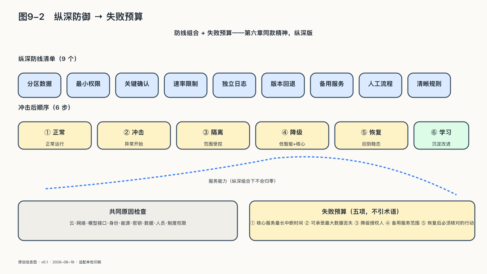

## 人类从来生活在依赖之中

没有人独自制造手机、生产药品或保存全部知识：孩子学习说话依赖家庭和社区，医生作判断依赖教育、仪器和同行，国家依赖贸易、能源和国际秩序。现代社会的生产力本来就来自这种依赖——陌生人依靠共同规则跨越时间和地域合作，才不必每一代都从零开始。

病人依赖医生，学生依赖教师，公民依赖公共机构，这些关系本来就包含知识和权力的不对称。依赖开始伤害自由，通常不是因为双方能力不相等，而是关系变得单向：一方可以随时改变条件，另一方却付不起离开的代价；一方看得见整套规则，另一方连规则怎样运行都不知道；风险可以转给所有人，收益却只留在一边。可以观察的界线是：较弱一方能否获得必要信息、拒绝额外用途、提出异议并更换服务，较强一方是否必须说明理由、接受约束并为后果负责。缺少这些条件，依赖就可能转化为单方控制。

AI让这种变化更难察觉。普通工具接收明确指令，智能系统却会学习偏好、积累记忆、代替人判断。系统越好用，下一件事越容易继续交给它；它对使用者了解得越深，迁移时需要带走的东西也越多。锁定因此未必写在合同的惩罚条款里，也可能藏在人与系统逐渐形成的默契中：平台会慢慢掌握替你写信、安排行程、判断客户和回应家人的方式，几年后文档可以导出，共同形成的工作方式却未必搬得走。

费用、接口、数据格式和迁移时间是看得见的成本；习惯、语境、组织记忆，以及自己已经停止练习的能力，则沉在关系里，要到离开时才被发现。判断自由是否存在，不能只看财产归谁，还要看这段关系给双方留下了多少行动空间。

判断一段技术关系是否健康，可以看进入、使用和离开三个时刻。

进入之前，需要知道自己接受了什么，是否存在可行的替代。免费试用只降低了首次使用的价格；如果退出代价被隐藏，第一次点击可能带来多年后的束缚。使用之中，你能否看见系统的行动，限制它的权力，参与重要规则的变化——系统不断增加权限，却只用漫长条款通知用户，形式上获得了同意，关系却越来越不对称。离开之时，你能否带走自己的资产，恢复基本能力，不因退出遭受不合理惩罚——若下载的只是一堆无法重建关系的文件，迁移权只是纸面权利。

个人订阅、学校采购、企业部署和国家合作的规模不同，这三个时刻却都存在；评价产品时，关系怎样开始、怎样变化、怎样结束，与功能多少同样决定使用者是否还有选择。

允许离开不会摧毁信任：员工可以离职，国家可以退出条约，客户可以更换服务。正因为退出真实存在，留下来才不完全是被迫的，关系也必须持续证明自己值得维持。

经济学家阿尔伯特·赫希曼曾把组织衰退时的反应概括为“退出”与“发声”：人可以离开，也可以留下来要求改变，两者不能互相替代。无法轻易退出的人更需要申诉和纠错；可以离开的用户，如果迁移会丢掉全部关系和记忆，也未必有力量要求平台改变。[^p9-exit-voice]

自由不只要求一项“我能不能离开”的决定权，还要求依赖关系看得见、条件可谈判、资产带得走、规则可修改；任何一条缺位，其余条款都会被慢慢掏空。退出和发声也必须落到工程实现：身份可被吊销，授权可限定范围，关键资产能以可读格式带走，离开之后组织记忆和专业关系能继续运转。赫希曼的判断今天依然成立，只是“退出”已经从搬家变成了一组可以在线完成的工程动作。
