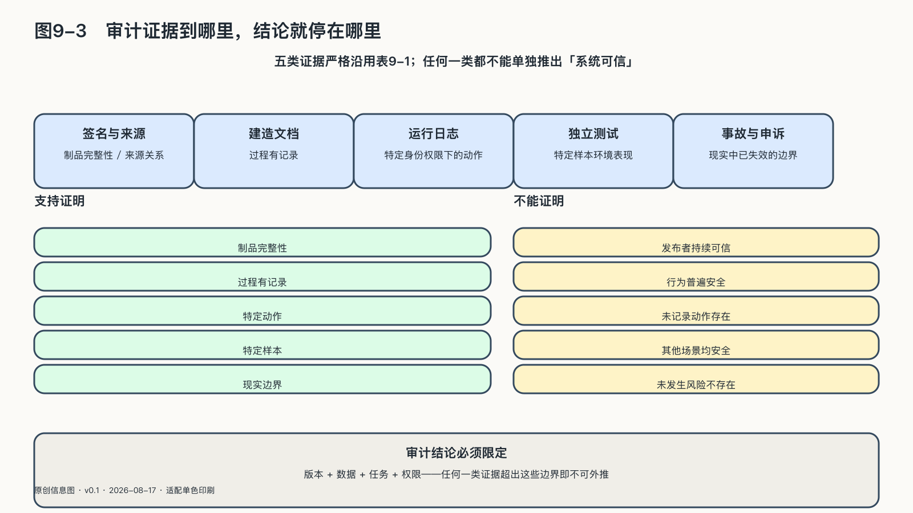

## 审计能够证明什么

协议和日志常给人一种过强的安全感，仿佛记录公开后，一名专家就能还原系统的所有内在原因，并为未来安全盖章。审计能证明的，永远只是证据能够支撑的那一部分；把审计当成盖章，恰恰是把它最值钱的东西——标明证据的边界——用反了。

不同证据只能支持不同强度的结论。密码学签名可以证明下载的模型文件与发布者签名的文件一致，传输中没有被悄悄替换。OpenSSF发布的Model Signing 1.0正在为不同格式和大小的机器学习模型提供签名与验证机制。[^p9-model-signing] 但签名不能证明发布者值得信任，也不能证明模型没有后门、偏差或危险能力。它证明的是完整性和来源关系，不是善良。

运行日志可以证明某个身份在某个时间调用了一项工具，却未必能证明人当时的意图，也不会自动记下未被仪器覆盖的环节。日志由被审计系统自己生成时，审计者还要检查记录范围、时钟、完整性和删除策略。

复现同样不等于验证正确：独立团队用相同数据和代码得到相近结果，能说明原报告不完全依赖隐藏操作；但如果原始指标就选错了，或数据不代表真实使用者，稳定复现只是稳定地重复同一个局限。

可验证审计需要不同证据相互校验：签名与来源、建造文档、真实任务的运行轨迹、独立测试，以及事故与申诉中的反例。NIST AI风险管理框架把文档、测试验证、透明问责与持续监测分别列出并相互连接，一份审计报告无法代替这些工作。[^p9-audit-boundary]

| 证据类型 | 能够支持的结论 | 不能支持的结论 | 需要的交叉验证 |
|---|---|---|---|
| 签名与来源 | 文件未被替换、来源关系可核验 | 模型行为安全、数据合法、输出正确 | 供应链审查与行为测试 |
| 建造文档 | 训练、配置和版本过程有记录 | 真实任务中一定有效 | 独立复现与生产测试 |
| 运行日志 | 谁在何时以何权限调用了什么 | 没有未记录的行动、动机一定清楚 | 日志完整性、权限与人工记录 |
| 独立测试 | 特定样本和环境中的表现 | 所有用户、版本和场景都安全 | 代表性抽样与反例 |
| 事故与申诉 | 哪些边界已经在现实中失效 | 没有发生过的风险不存在 | 持续监测与补救演练 |

审计还有一个与透明相反的责任：不让审计本身成为新的伤害。为了追踪智能体，系统可以记录全部对话、工具参数和返回内容，其中也可能包含病历、凭据、商业秘密和个人经历——“什么都记”让误用容易追查，却会造出一座更有价值的敏感数据仓库。记录范围应从未来需要证明的问题出发：判断一个智能体是否越权删除文件，日志需要保留代理身份、工具名称、权限、对象引用、时间和执行结果，未必需要把整份文件再复制一遍；完整性校验证明对象没有被替换，受控的原始存储可在需要调查时按权限打开。

对模型行为的检查也不必穷尽所有输入——现代模型的可能输入远远超过任何审计团队能够遍历的范围。更科学的报告会说明样本怎样选取，覆盖了哪些人群和失败模式，哪些结论只适用于特定版本和权限，并邀请当事人、领域专家与攻击者用新反例推翻它。一份能被推翻、写明适用条件的审计结论，比一枚永久有效的“已通过”标章更可信；笼统宣告“这个系统已经可信”没有同等的证据价值。

审计还要求给行动留出被检查的时间：平台可以一夜改变规则，申诉、调查和社会信任的恢复却仍然缓慢。高影响行动有时需要刻意保留等待期、速率限制和分阶段发布，让人的判断有时间进入，也避免错误扩散到无法收回。

复杂社会离不开信任，也无法要求每个人检查每一行代码。信任需要证据维持：承诺写进规则，关键行动留下记录，独立主体能够检查，失信以后仍有补救和替代。故障后的恢复、协议层的控制权分配和持续审计，都在检验同一件事——依赖关系中的各方是否仍有行动能力。

到这里，本章守住了依赖不变成支配的底线：事故后能恢复，规则不由单方私定，承诺有证据可查。但守住底线不等于争取主动：还有一类策略不是防御依赖的后果，而是改变依赖的条件本身——这就是开放。开放能否经得起离开、攻击和时间的检验，是下一章要回答的。
