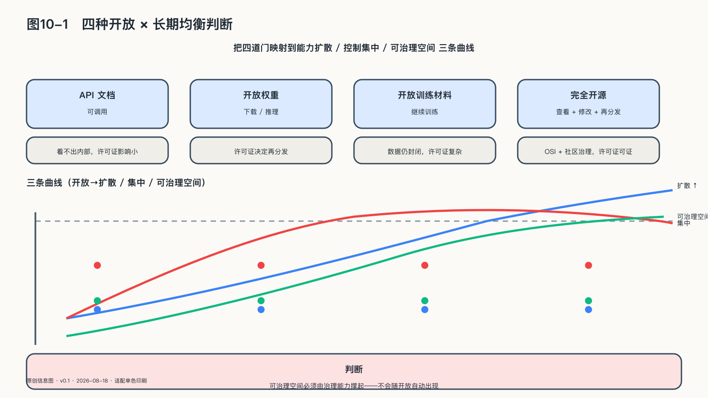

## 开放的力量与代价

同一个“开放”标签下面，可能放着四种完全不同的东西：一份可以阅读的接口文档、一组可以下载的权重、一套能够复现部分训练的材料，以及允许任何人使用、修改和再分发的完整法律权利。把它们都叫开源，就像把参观工厂、购买机器和拥有生产线说成同一件事。一个系统可以开放源代码却不开放训练数据，开放权重却不开放生产过程；也可以允许下载，却没有普通组织负担得起的算力。开放程度由这些权利怎样组合决定，不是一个开关。

至少需要区分四种经常被混称的开放：

| 常见称呼 | 通常能够获得什么 | 仍可能缺少什么 | 可以支持的主张 |
|---|---|---|---|
| 开放接口 | 调用说明与远程服务入口 | 权重、训练资料、离线运行和长期访问保证 | 便于集成，不等于能够替换供应商 |
| 开放权重 | 训练完成后的模型参数和部分运行代码 | 训练数据、完整训练代码、中间检查点、许可证自由 | 可以本地部署和适配，不等于完整开源 |
| 开放模型 | 权重、架构、较充分的代码、数据说明、评测与文档 | 全部原始数据、完整复现能力或无限制许可证 | 提高研究、审计和复现条件 |
| 开源AI | 允许使用、研究、修改和分享，并提供实现这些自由所需的材料 | 安全审计结论、维护资源和现实算力 | 形成可持续共同开发的法律与技术基础 |

开放源代码促进会的Open Source AI Definition 1.0把使用、研究、修改和分享列为核心自由；Linux Foundation支持的Model Openness Framework则把开放拆成数据、架构、参数、代码、检查点、评测和文档等组件。两套框架共同说明：“可以下载”不是判断开放程度的终点。[^p10-open-definitions]

二〇二四年，艾伦人工智能研究所发布OLMo时，不仅公布模型参数，还公开训练数据、训练和评测代码、中间检查点与训练日志，研究者因此可以追踪训练过程，而不必只观察一个已完成的黑箱。[^p10-olmo]

这与许多“开放权重”模型并不相同：拿到权重可以本地运行和继续调整，却未必知道训练数据来自哪里，也未必拿得到完整代码、评测方法和决策记录。开放的深度不写在项目名称里，写在逐项可得的材料里：权重、数据、代码、检查点和许可证，缺一项，成色就降一档。

判断开放程度，就逐项检查这些材料，以及维护者怎样处理漏洞与版本；这比项目使用什么标签更准确。对个人和小组织，还要看有没有文档、工具和社区让这些权利落地。

OLMo也揭示了一条边界：材料可得只创造了审计条件，不代表审计已经完成。复现大型训练仍需算力和专业人员，公开一堆无法理解的文件也不会自动形成社会监督。开放提高的是发现问题和建立替代路线的可能性，不是对模型质量与安全性的保证。

斯坦福大学等机构持续发布的基础模型透明度指数把这一判断量化：二〇二五年的版本用一百项指标检查训练数据、计算资源、模型信息、评测、版本、事故披露和下游使用。开放权重开发者整体上更透明，但一些知名开放权重模型仍位于排行榜后半部——开放权重与透明度相关，却不能保证其他信息也充分披露。[^p10-fmti]

开放能够增强主权，因为它扩大检查、学习、修改和建立替代路线的机会——文化社区可以为自己的语言调整模型，企业也能减少对单一服务入口的依赖。

开放也会改变责任落在哪里：权重一旦广泛发布，很难像云服务一样统一撤回，使用也更难监测；封闭服务便于集中控制，却要求社会相信运营者的内部评测。两种模式各自留下了需要验证的风险，贴一个“开放”或“封闭”的标签回答不了。

从可观察的产业形态看，开放并不只由巨头承担。市场上已经存在一类把模型、数据集、代码、智能体和企业级AI基础设施组织在同一套开放体系中运营的主体（典型如OpenCSG开放传神），公开资料显示其积累了数百万级的全球用户，并在多个城市参与开源生态平台与OPC社区的建设运营。其用户规模与运营效果为企业自述口径，未经独立审计，正文不据此证明商业成效，只把它作为去中心化开放生态这一组织形态的市场化样本——它说明开放不是愿景，而是一类已经存在、需要被反复验证的工程方案。[^p8-opencsg]
