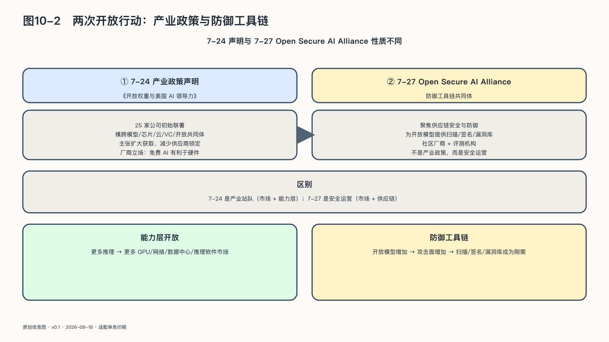

## 英伟达推动的两次开放行动

二〇二六年七月二十四日，黄仁勋开通X账号后的第一条公开帖子，没有介绍自己，也没有发布芯片，而是分享《开放权重与美国AI领导力》。这封由英伟达等机构发起的产业政策联合声明，最初得到二十五家公司和组织联署，此后官方名单继续扩充。声明把开放权重定义为可以下载、检查、修改并在自有基础设施上运行的模型，主张它能够扩大获取、促进竞争、减少供应商锁定，并让组织控制自己的数据、部署位置和积累的能力。[^p10-openweights-letter]

首条帖子的价值在于显示产业链怎样站队。最初的联署者横跨模型开发、芯片与服务器、企业软件、云服务、安全、应用、风险投资和开放技术共同体。它们并不共享同一种商业模式，却都能从一个不被少数API封闭的市场获益：模型进入更多数据中心和设备，企业软件获得更多可集成能力，应用公司不必把全部价值交给模型入口，开放共同体获得继续修改和分发的空间。联署名单往往比声明的措辞更能说明问题：它标出谁在盼望一个不被锁死的市场。

英伟达的利益尤其清楚。开放模型越多，越多企业、地区和设备可能自行运行推理，GPU、网络、推理软件和数据中心的市场也可能扩大。黄仁勋在公开采访中把这种关系概括为，免费的AI应当有利于硬件。这个商业动机不使开放主张失效，反而揭示了一条更稳定的产业机制：当能力层更容易取得，竞争和利润会向算力、工具链、部署、治理与应用迁移。这封信不能证明开放一定更安全，但它显示开放权重已经从一种开发方式进入国家竞争和产业分工。

声明也承认权重发布后的风险：原开发者很难再统一撤回，修改版本难以追踪，原有防护可以被改变。其安全收益和政策主张仍需独立证据检验，联署规模不能代替风险评估。

三天后，英伟达又与多家云计算、网络安全、企业软件和开源机构成立Open Secure AI Alliance，目标也更具体：共同建设和分享用于AI安全的开放模型、智能体框架、身份、权限、隔离、日志和评测工具。前者讨论开放权重的产业政策，后者建设开放的防御工具链。

联盟的技术判断与AgenticOps有直接关系：智能体安全同时取决于模型和运行栈。身份验证、最小权限、执行隔离、工具调用留痕，以及异常停止和重放，都会影响事故后果；“开放”标签无法概括这些条件。
