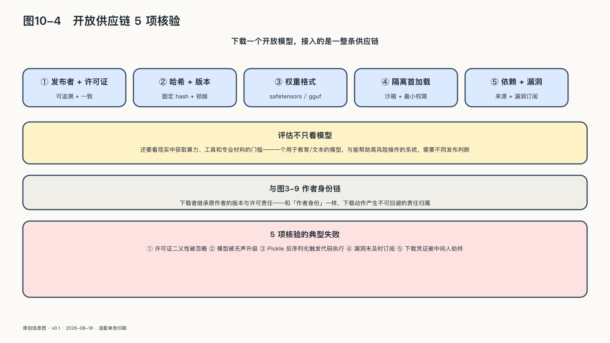

## 开放必须经得起现实检验

下载一个开放模型，接入的不只是一组权重，而是一整条供应链。开放生态的风险也不只来自模型会回答什么。模型文件可能使用能够触发代码执行的序列化格式，加载过程还会调用自定义代码与外部依赖。二〇二四年的研究《Models Are Codes》对预训练模型中心中的恶意代码投毒进行了系统测量；Hugging Face自己的安全文档也明确说明，平台扫描不能保证发现所有恶意Pickle文件。[^p10-model-supply-chain]

下载模型不能按普通静态数据处理。组织需要核验发布者与许可证，固定版本和哈希，优先采用更安全的权重格式，在隔离环境中完成首次加载，并保留来源、依赖、漏洞报告和更新记录。开放让更多人能够检查供应链，也把一部分原来由集中服务商承担的验证责任交给使用者。

同一个开放程度，在不同能力和用途下可能产生不同后果：用于教育和文本处理的模型，与能够显著帮助高风险生物或网络操作的系统，需要不同发布判断；评估也不能只看模型本身，还要看现实中获取算力、工具和专业材料的门槛。开放政策应当说明开放了什么、谁获得了哪些能力、谁承担新增风险，以及发现问题后有哪些补救手段；必要时，先向经过验证的研究者提供受控访问，积累评测和防护证据，再逐步扩大范围。

开放生态还需要维护者。如果社会把开放理解成“有人免费提供”，关键项目就会依赖少数贡献者的额外劳动——基础组件无人资助、漏洞无人修复、文档无人更新，表面上的公共资源会变成看不见的单点。

成熟的开源共同体早已把这个问题当成治理问题。Apache基金会强调公开沟通、共识决策、供应商中立和能够交接权力的项目委员会，因为代码可以被复制，维护责任却不会自动复制。二〇一四年的Heartbleed漏洞之后，Linux Foundation发起核心基础设施计划，开始识别和资助那些被大量依赖却资源不足的基础组件。[^p10-open-governance]

二〇二四年的xz Utils后门又显示了另一面。恶意代码进入5.6.0和5.6.1发布包，并试图在特定环境中影响SSH认证。问题最初因登录延迟和处理器消耗异常而被发现，受影响版本尚未广泛进入主要稳定发行版。事件既不能证明开源天然不安全，也不能证明“代码公开就一定有人检查”；它说明攻击者可以同时利用维护者压力、长期信任、发布流程和构建差异。[^p10-xz]

支持开放，不只是下载和使用，也包括贡献代码、报告问题、资助维护、参与标准和培养能够接手的人。

主权价值来自可持续的共同能力，而不只来自文件可以获得。共同资源也不只有“交给国家”或“交给市场”两种治理方式。埃莉诺·奥斯特罗姆对公共资源的研究表明，清楚边界、参与者共同制定规则、监测、渐进制裁和低成本争议解决，可以让多个相对自主的治理中心长期合作。[^p10-ostrom] 开放AI要成为公共能力，同样需要这些看起来不如模型发布耀眼的制度。

这些事件放在一起，已经排除了开放最容易被写成的样子：一种不会错的道德立场——参与者更多，错误就会更少；代码能看，问题就会被发现；项目能复制，任何人就都能接管。这些关系不会自动成立。

科学命题之所以有力量，是因为人们能够说出什么证据会让它失败。开放生态的主权价值也应接受同样待遇：一份声称开放的规范若始终只有一个可用实现，“降低单一供应商依赖”就没有获得运行证据；一个模型可以下载，却没有第三方能在合理成本下运行、修改或检查，其开放对实际选择的贡献就很有限；一个社区名义上允许参与，安全修复、发布密钥和路线决定却永远只由一家企业掌握，其治理开放就应当被重新评估。

最有说服力的证据常常来自离开：原维护者不再维护时，社区能否交接发布和修复？云平台停止支持时，同一模型和工作流能否到另一个环境继续运行？参与者不接受主流路线时，能否合法且技术上可行地建立分支？开放不要求人们经常离开，但只有离开能够发生，留下才不是被迫接受。

安全事故则提供了另一种反证。更应该观察的是：谁有权发布修复，用户能否得知哪些版本受影响，修复能否被独立验证，事故后修改的是工具、流程和治理，还是只换了一个名称。如果同类事故一再发生，开放生态不能用“理论上任何人都可以检查”来免除自己。

这种可证伪性也保护开放：人们不必把一次事故当成对开源的总否定，也不必把一个成功项目当成开放永远正确的证明。判断回到具体条件——材料是否真的可得，不同实现是否真的存在，权力是否能交接，维护是否持续，反例是否会改变项目。

开放能保证的是机会，不是结果。它可以让更多人获得材料，却不保证他们拥有理解材料的专业能力；可以允许第三方运行模型，却不保证第三方买得起算力；可以暴露代码和训练线索，却不保证问题会被及时发现。文档、工具、人才、组织和资源，决定形式上的机会能否成为关键时刻用得上的能力。一张许可证只能说明起点，开放还要经过实现、使用、攻击、修复和反复比较，才可能形成持续的共同能力。

这条路上，开放有几种常见的走偏方式。

第一种，开放变成新的中心化入口：少数平台把许可证、版本目录、身份和计费统一收编，开发者形式上获得自由权重，实质上仍被运行栈决定退出成本——一种“可以下载”的承诺，并不能替代一条可以离开的通道。

第二种，开放成为新一轮审计负担：漏洞披露、许可证合规、安全评测和供应链溯源压向每一个发布者，中小团队难以承受，生态反而被挤压到少数有法务能力的大厂——开放本想扩大参与者，最后却把参与者挤出场外。

第三种，开放是公关而不是承诺：宣布开源用来塑造形象，缺少长期维护、社区治理和更新预算，半年后仓库进入长期静默，再换一个名称重新开始。

判断一种开放是否成立，不能只看许可证。还要问：形式上的开放权，背后有没有工程化的兑现？维护有没有着落？争议出现时由谁裁决？这些都做不到的开放，更接近一次品牌动作。
