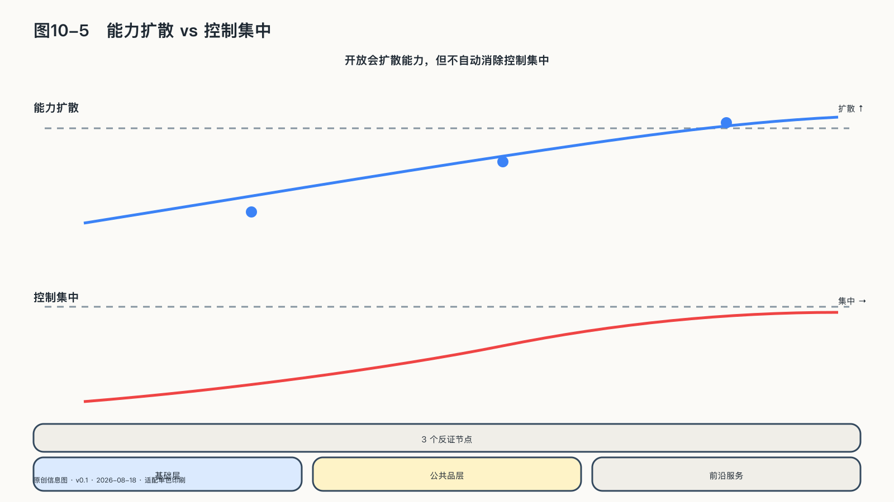

## 开放会成为长期均衡吗

如果模型能力可以通过论文、人才流动、开放权重、蒸馏和量化不断扩散，是否意味着AI最终一定开源？这个推断抓住了一股真实力量，却跨过了两个未经证明的台阶。

第一，能力扩散不等于生产过程开放。学生模型可以从教师生成的答案中学会许多行为，却未必得到教师的权重、训练数据、完整概率、系统工具和工程配方。技术上“能够模仿一部分”，不能自动变成法律上“可以复制”，更不能变成组织上“有能力重建”。

第二，开放权重不等于严格开源。符合Open Source AI Definition的系统要允许使用、研究、修改和分享，并提供实现这些自由所需的材料。大量被市场称为“开源大模型”的项目，只开放了权重或部分代码，并保留用途、规模、再分发或训练材料方面的限制。

从当前结构看，更可能长期并存的是三层：开放权重成为广泛使用的通用基础层，严格开源形成规模较小却不可替代的科研与公共品层，封闭API继续占据部分最新前沿、高责任运营和高密度服务场景。

支持分层的力量首先来自模型方法的可积累性：前沿公司证明某条路线有效后，后来者不必重新搜索全部失败空间；开放权重还允许成千上万的开发者做语言适配、行业微调和端侧部署；本地运行、版本固定、数据不出域对企业和公共机构也有真实价值。

严格开放在工程上也已经存在。Ai2的OLMo 2不仅提供最终权重，还提供训练数据、代码、配方、中间检查点和评测。其三百二十亿参数版本训练至约六万亿Token；同一个数字也说明，取得复制权与拥有复制能力仍相距很远。[^p10-open-equilibrium]

限制扩散的力量也很具体：前沿训练的资本、能源、芯片和组织门槛可能继续上升；专有用户反馈和行业数据不会因权重发布而自动共享；云平台可以在开放模型上继续掌握算力、身份、计费和分发入口；安全、责任和持续更新要求也会让一些客户选择集中服务。开放甚至可能降低模型层的锁定，却把依赖重新集中到少数芯片、云和托管平台。

Stanford AI Index 2026提供了一次现实提醒：开放权重模型与最强封闭模型的差距曾缩小到约百分之零点五，随后又扩大到约百分之三点三。开放具有追赶力量，却不是一条只会向胜利移动的直线。[^p2-moving-frontier]

模型谱系也在同一时间变得更加多层：Qwen3同时提供从零点六至三十二亿参数的密集模型和三百亿级、两千亿级的稀疏模型；Mistral 3把三十亿、八十亿、十四亿级多模态模型以Apache 2.0发布；Gemma 4则把多模态MoE推进到可离线运行的端侧规模。开放生态的竞争单位已经从“有没有一个可下载模型”变成许可证、训练透明度、量化、端侧运行、工具链和长期维护的组合。[^p1-frontier-landscape-2026]

下面几项长期数据，可以检验这套分层是否成立：

| 观察什么 | 开放基础层假说增强 | 假说受到削弱 |
|---|---|---|
| 能力差距 | 开放权重模型在多类真实任务上长期接近前沿 | 差距在多数关键任务持续扩大 |
| 生产使用 | 本地与云端生产任务中，开放模型份额持续增加 | 开放模型长期停留在演示和低责任任务 |
| 开放完整度 | 更多重要模型公开数据说明、训练代码、配方和检查点 | 权重数量增加，训练过程却更加不可复现 |
| 分发结构 | 开放模型支持多云、本地和独立服务商生存 | 绝大多数使用仍必须经过少数平台 |
| 治理连续性 | 原开发者退出后，社区仍能修复、发布和交接 | 项目离开单一企业便停止维护 |

表中的指标没有预先设定赢家，“最终会开放”是否成立，要由后续数据修正。

开放与封闭更可能重新分工：基础模型、协议、评测、数据工具和控制面形成共同底座；企业在前沿模型、运行服务、行业数据和责任保障上继续竞争；组织可以在两者之间路由任务，并保留迁移路径。开放增加了后来者的学习材料、使用者的退出选项，以及共同体建设公共基础设施的可能，也让单一中心更难永久封闭全部能力。

Hugging Face 2026年春季生态报告显示，过去一年该平台约41%的模型下载量来自中国研发的模型，中国首次超过美国成为该平台下载占比最高的国家。同一报告还援引Stanford AI Index 2026的数据：截至2026年3月，美国最强模型对中国最强模型的领先收窄到约2.7%，单一基准差距不能外推为完整能力对比，但竞争焦点已经从“谁的模型最强”转向“谁组织全栈体系、开发者生态和产业标准”。[^p8-hf-opensource-2026] 对国内生态这也是机会：规则透明、版本可追溯、接口可退出，本土开发者就能在多个平台和模型之间建立自己的工作流，而不必依附单一入口。下载量反映开发者采用热度，不等于能力排名；但开放不仅是一种许可证，也是一种产业秩序。

开放回答了能力怎样扩散、使用者怎样保有退出选项，但回答不了另一类问题：多方必须共享数据与经验，却不愿先把控制权交给一个中心；而当智能进入生产内部，自由的人还要组成仍然保有自由的组织。协同与组织，这是下一章要回答的。
