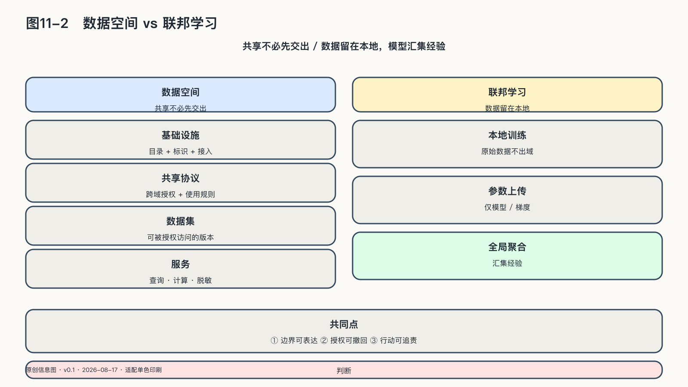

## 分布式协作的两条技术路径

开放模型回答能力怎样扩散，仍有另一类问题：多方必须共享数据与经验，却不愿先把全部控制权交给一个中心。数据空间和联邦学习提供了两种尚不完美、但可以检验的技术路径，要证明同一件事：共享和交出控制权，本来是两件事。

### 数据空间：共享不必先交出

医疗研究需要跨医院样本，供应链需要企业共享状态，气候治理需要跨地区数据。把一切封闭起来，会损害知识和公共利益；把一切集中到一个仓库，又会形成新的控制中心。

数据空间尝试在封闭与集中之外另建一条路：数据继续保存在医院、企业、研究机构和公共部门手中，参与者公布“我有什么、在什么条件下可以使用”，需要者获得授权后，再通过共同身份、语义和合同规则访问。发现、授权、传输、处理和追责被拆成不同环节，可采用不同控制条件；一条数据进入空间，需要带着上下文：谁产生、允许什么目的、能否转交、结果是否需要回馈。

截至二〇二六年，欧盟正在健康、农业、制造、能源、交通、金融、公共行政、科研和文化遗产等领域推进共同数据空间，并提供参考架构、语义规范和数据模型。[^p9-data-act] 这些项目仍有利益不对称、合规复杂和实施成本，不能被当成已完成的答案。它们的启发在于，把协作的单位从“交出数据”改成“授予一项有边界的使用”。边界能否执行，决定数据空间是不是换了名字的集中平台：强势参与者可能用技术要求抬高门槛，或用广泛用途条款取得事实控制；小机构虽保留数据，却没有能力理解合同或部署接口。治理因此还要提供共同工具、标准合同、争议解决和独立监督——数据空间不只是技术工程。

### 联邦学习：数据留在本地，模型汇集经验

联邦学习提供了另一种方式。用一个解释性场景来看：三家医院希望共同训练一个识别罕见疾病的模型，但病历不能集中——这不是某项真实临床项目的效果声明。联邦学习把初始模型分别送到各医院，在本地数据上学习，再把模型更新送回协调方汇总；反复几轮后，各方得到一个吸收了多家经验的模型，原始病历仍留在原处。

模型更新本身仍可能泄露训练数据特征，恶意参与者也可能提交被污染的更新，让共同模型学到后门；原始数据没有移动，并不能单独证明隐私问题已解决。

隐私保护联邦学习通常还要叠加安全聚合、差分隐私、加密、参与者验证和异常检测：安全聚合让协调方只看到多方更新的合计，差分隐私降低从结果反推个体的可能，治理规则则规定谁能参加、模型可用于什么目的、发生泄露时谁负责。防护之间也有取舍。NIST与英国相关机构的联合研究同样把联邦学习与这些隐私增强技术放在一起讨论，而非单独的万能方案。[^p11-fl]

技术也替代不了利益协商：哪一家医院定义研究问题，共同模型的商业价值怎样分配，一家机构退出后已吸收其数据经验的模型怎么办？这些问题不可能只靠数学优化回答。
