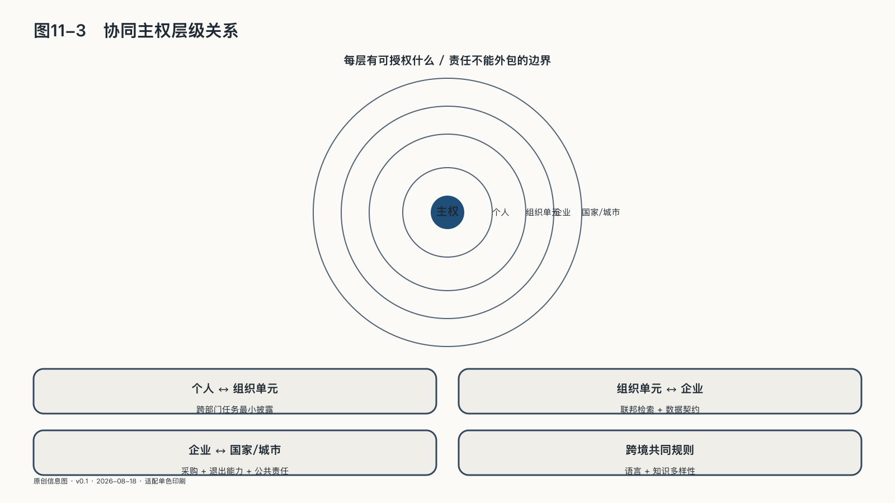

## 协同主权的层级关系

个人、组织单元、企业和国家、城市并非四座孤岛。个人要进入部门与团队才能完成复杂生产；组织单元需要企业提供公共底座，同时保留自己的数据和行动边界；企业依赖开放生态、人才与市场秩序；国家能力也来自个人、组织和企业的持续创造。任何一层过弱，影响都会沿着关系向外传递：个人没有迁移能力，市场竞争会变成平台争夺被锁定的用户；部门没有隔离与协同能力，企业要么形成数据孤岛，要么制造一个权限无限的中心；企业没有替换和恢复能力，国家的关键服务会建立在纸面安全上；政府没有边界，其他层的技术能力也可能被公共权力吞没。

各层既要保护自己的边界，也要为别人保留选择：个人不能把风险全推给组织，部门不能借协同无限索取其他域的数据和权限，企业不能用技术复杂性逃避责任，国家不能以公共利益之名取消公民的申诉和退出空间。

同一个智能体可能同时跨越四层：在个人设备上接受指令，经由部门平台调用企业服务，并受国家法律约束。个人用授权保护意图，部门用数据契约和属地执行保护边界，企业管理工程生命周期与外部供应商，国家提供法律与公共监督。问题相似，责任不同；任何一层只顾自己的控制台，责任都会消失在接口中。

这些关系还跨越国界。AI风险、科研、网络安全、气候和疾病不会停在边境。联合国大会在二〇二五年设立独立国际AI科学面板和全球AI治理对话，并在二〇二六年举行首次全球对话，试图以持续科学评估和多方协商建立公共讨论。[^p11-un-dialogue] 这类机制是否有效，仍取决于各国能否获得信息、专家，并实质参与规则形成。国际合作既不能用“全球标准”掩盖少数人的默认值，也不能拿“各自选择”回避跨境伤害；共同规则要给不同技术路线和发展道路留出空间。

### 语言与知识多样性

如果所有语言都通过少数模型理解，所有“好答案”都来自相近的数据，人类会获得前所未有的沟通能力，也可能失去一些难以量化的差异。语言不只传递信息，也保存一个群体怎样理解家庭、时间、责任和自然；一个词的边界、一句谚语的隐喻，都包含历史经验。

文化主权并不要求模型只说本地人爱听的话，也不是把传统偏见永久写进系统。它要求一个社会有能力用自己的语言表达经验、质疑自己、修正自己，并参与塑造机器怎样理解世界。

低资源语言面对的远不止翻译误差：公共服务的语音系统听不懂一种口音，教育AI缺少当地知识；文化资料被抓取训练，社区却无权决定神圣、私密或受限制的知识能否使用，数字保存反而可能带来新的剥夺。

UNESCO的数字时代多语言全球路线图把语言共同体参与决策和文化数据治理放在核心位置，同时提出多语言技术标准、能力建设和低资源语言研发。[^p11-unesco-language] 保存语言样本的机构只是参与者，仍在使用这种语言的人才是文化延续的主体。

语言要在使用、创造和争论中延续，知识多样性也不能简化成给同一个答案换几种语言。如果训练数据、评测标准和界面分类只保留少数主流表达，模型会系统性降低其他知识的可见度——这既是文化问题，也是数据代表性和系统有效性问题。

文化主权要保护一种语言继续产生新表达的能力，而不只是保存固定答案。模型可以帮助保存濒危语言，也可能把活的文化压缩成统计标签；判断差别，可以看社区是否参与定义数据用途、访问边界、评测标准和纠错机制，而不只是被动提供训练材料。
