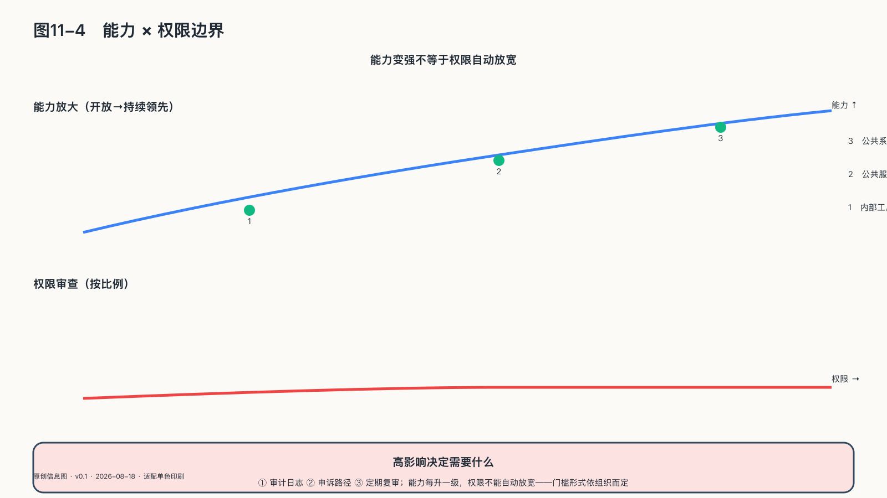

## 为更强能力保留制度边界

面对变化很快的技术，政策制定者容易走向两个极端：抢在未来之前写下非常具体的规则，或者以未来不可预测为由暂时什么都不做。前者可能把今天的产品结构冻结成法律，后者则让平台默认值先长成事实制度。稳定的权利要求和需要不断更新的技术规则，应当分开处理。

高影响行动需要授权，受影响的人能够知情和申诉，公共权力不能用机器逃避说明，关键资产能够迁移，事故必须留下证据——这些要求不会因模型换代而失去意义。阈值、测试方法、风险分类和技术标准则应随能力和事故证据变化。

更新机制本身也需要设计：能力或使用范围发生重大变化时应重新评估；临时授权应有到期条件；高风险用途应定期审查；退出时要保留数据、日志和可运行的替代流程。这样，今天的基础设施不会因技术和合同锁定而变成后来者无法修改的安排。

制度还要保留暂停和复查窗口：每一次扩权单独看都有理由，合在一起却可能让人工判断逐步退出；暂停的用途很具体——在影响扩散之前，检查原来的假设、数据和权限是否仍然成立。

AI擅长把大量材料压缩成摘要和建议，压缩会丢失个案差异和少数意见。在医疗、教育、司法和公共决策中，需要事先规定哪些原始证据必须保留，哪些决定必须允许后来者重新解释；版本、日志和人工理由一旦在自动化过程中丢失，后来的人就算想修改，也找不到下手的位置。

### 能力更强，权限也不能自动扩大

如果有一天，AI给出的方案不仅更快，而且在预测、规划和资源配置上长期优于大多数人，人类最难说出口的词可能不是“相信”，而是“拒绝”。能力提高会增加委托收益，也会扩大一次授权可能覆盖的范围。这种稳定优势比偶发的明显错误更需要提前分析。

这里必须分开三个问题：认知能力关心系统能否给出更准确的预测和更好的方案，可以通过评测持续检验；行动权限关心系统能否调取数据、调用工具、分配资源或触发强制措施，仍应由明确授权决定；主体地位则追问系统是否可能拥有利益或权利请求——目前没有可验证的统一答案，即使未来出现新证据，“系统应获得何种保护”与“系统是否有权治理他人”仍是两个问题。

性能优势不会自动产生公共权力。公民参与公共决定，不是因为计算能力排名靠前，而是因为他们受决定影响、享有法律权利，并处在可以追责和互相承担义务的制度关系中。系统可以改善事实判断，却不能仅凭性能指标取得设定公共目标、扩大权限或取消申诉的资格。

面向更强AI的治理不必先押注某一种能力预测：权限与能力分离、高影响行动分级授权、能力漂移监测、独立评估和人工复核，都可以提前建立；系统仍要可暂停、可替换，规则也要能随新证据修订。

这些边界约束的是授权和监督，并不取决于人们对强AI持乐观还是悲观态度。能力再强，也不能跳过取得权力的程序。

到这里，本章上半部分守住了系统之间的自由：共享不必先交出控制权，更强能力到来时权利也不会被自动掏空。但当智能体开始承担跨小时、跨工具、跨职能的完整任务，组织本身会变成什么形态，是下半部分要回答的。
