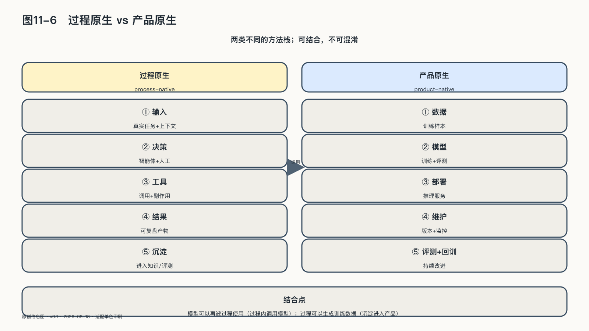

## 过程原生与产品原生

“AI原生”这个说法，至少混合了两种不同变化。

第一条发生在组织内部。大模型参与研究、编程、客服、销售、财务和运营，人把部分认知劳动委托给智能体。这是过程原生：同一件产品仍由企业交付，但生产它的分工、速度和知识流发生变化。

第二条发生在产品内部。原来必须由员工逐单完成的知识工作，被模型和软件做成客户可以直接使用的能力。这是产品原生：企业不是简单让员工更高效，而是把一部分服务本身变成可复制、可持续运行的产品。

二〇二六年的一项工作论文比较了二〇二〇至二〇二四年间进入Y Combinator的创业公司，并连接美国风险投资企业的人员微观数据。研究者把AI原生公司的差异归纳为上述两条通道：组织结构差异主要不取决于招聘广告里多写了几个AI工具，而取决于AI能力有没有进入企业出售的产品。[^p11-ai-native-firms]

这个结论不能直接套到成熟制造企业、医院或政府机构——研究样本是年轻的风险投资公司，论文截至二〇二六年八月仍是工作论文。但它提供了一个比“AI使用率”更有用的判断：AI究竟只在帮助组织做事，还是已经改变组织向外提供价值的方式？

一家律师事务所用大模型起草合同，属于过程变化；如果它把条款比较、风险解释和律师复核组成客户可持续调用的服务，产品边界也变了。

两者经常一起出现，但一句“我们是一家AI公司”分辨不出它们。
