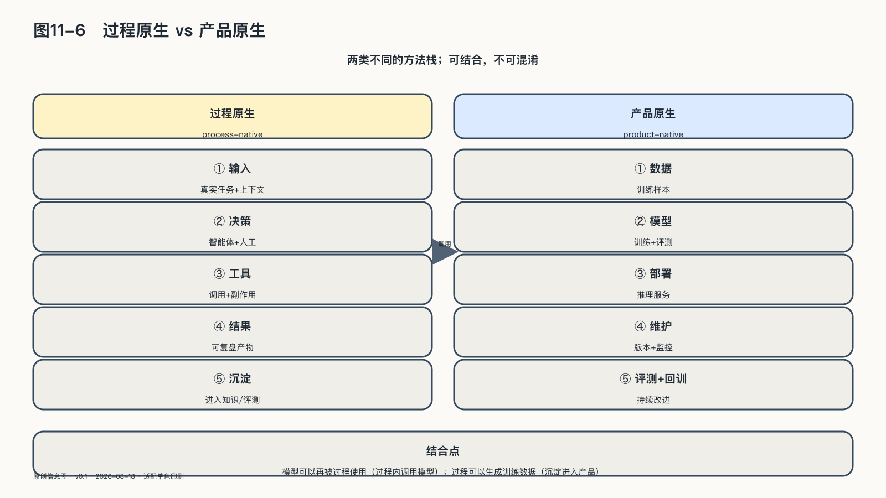

## 过程原生与产品原生

想象一家律师事务所。律师用大模型起草合同、检索判例，报价和交付还是老样子，生产它们的分工、速度和知识流却变了。这类过程原生发生在组织内部：人把部分认知劳动委托给智能体，企业交付的仍是同一件产品。

另一条路在产品内部：条款比较、风险解释和律师复核被打包成客户可持续调用的服务，一部分服务本身变成可复制、可运行的产品。原来由员工逐单完成的知识工作，成了客户可以直接使用的能力，这是产品原生。

二〇二六年的一篇工作论文比较了二〇二〇至二〇二四年间进入Y Combinator的创业公司，并连接美国风险投资企业的人员微观数据。研究者发现，AI原生公司的组织结构差异，主要不取决于招聘广告里多写了几个AI工具，而取决于AI能力有没有进入企业出售的产品。[^p11-ai-native-firms]

样本是年轻的风险投资支持企业，结论不能直接套到成熟制造企业、医院或政府机构；论文截至二〇二六年八月仍是工作论文。它给出比“AI使用率”更有用的分辨：AI是只在帮组织做事，还是已改变组织提供价值的方式。
