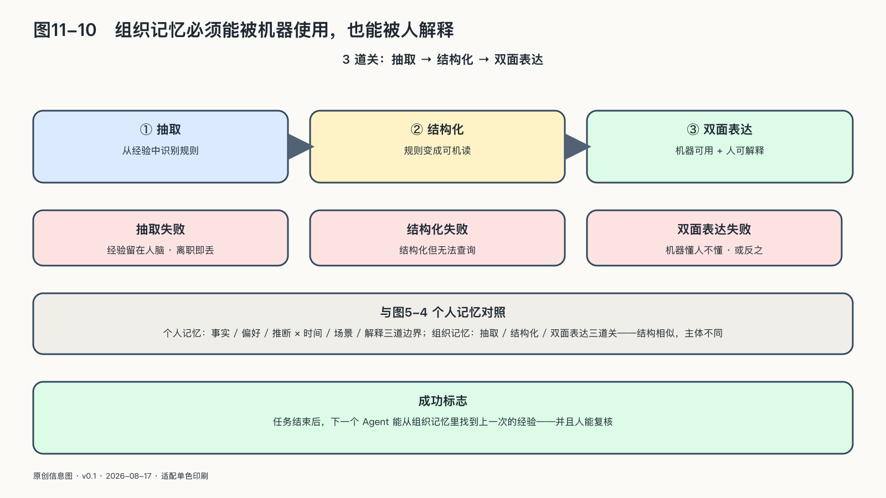

## 组织记忆必须能被机器使用，也能被人解释

传统组织把大量知识藏在人的经验、聊天记录和无法检索的文档里。员工离职，项目为什么这样设计、哪些例外曾经失败，也会一起消失。

大模型让非结构化材料第一次可以被较低成本地检索、归纳和转写，但“把所有文件接入RAG”并不等于获得组织记忆：旧版本政策、未经确认的会议发言和正确制度可能同时被检索出来；模型能够生成一个流畅答案，却不知道哪份材料拥有决定权。

AI原生组织需要两层记忆。第一层是事实与规则：数据、文档、流程、接口、责任人、版本和有效期，它告诉智能体什么可以作为依据。第二层是运行经验：任务怎样完成，什么地方失败，谁做了纠正，结果后来是否被现实证明，它告诉组织一次行动究竟有没有产生价值。

两层都必须带来源：没有血缘和版本的知识库，会把历史错误变成模型上下文；没有结果反馈的执行记录，只能证明系统忙过，不能证明它学会了什么。人工纠正也不能直接拿去训练下一版模型——它可能包含临时妥协、个人偏好或受保护信息，需要经过用途和责任审查。

这类记忆应当是组织资产，而不是某家模型供应商账户里的副产品：模型可以更换，向量数据库可以迁移，任务定义、评测集、失败案例和专业规则必须能够导出并继续解释。否则组织越依赖大模型，越可能把学习史交给外部平台。

但记忆一旦能够被机器调用，谁以什么身份使用它、能够据此采取什么行动，就必须成为下一道边界。
