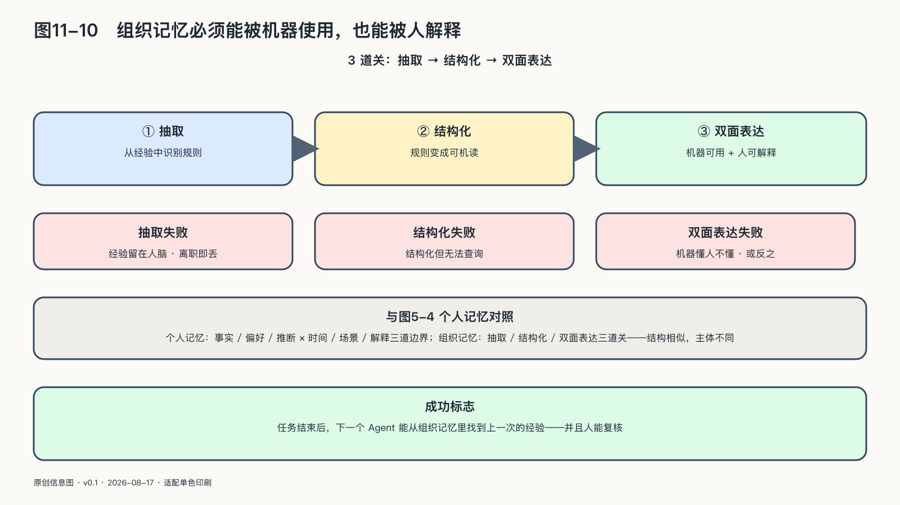

## 组织记忆必须能被机器使用，也能被人解释

一位干了八年的项目经理离职。她走后，没人说得清为什么放弃那个看似更优的方案、哪几个例外曾经失败——大量组织知识藏在个人经验、聊天记录和无法检索的文档里，人一走，一起消失。

大模型让非结构化材料第一次能被低成本检索、归纳和转写，但“把所有文件接入RAG”并不等于获得组织记忆。

AI原生组织需要两层记忆。第一层事实与规则：数据、文档、流程、接口、责任人、版本和有效期，告诉智能体什么可以作为依据。第二层运行经验：任务怎样完成，什么地方失败，谁做了纠正，结果是否被现实证明，告诉组织一次行动有没有产生价值。

两层都必须带来源。没有血缘和版本的知识库，会把历史错误喂给模型上下文；没有结果反馈的执行记录，只能证明系统忙过，不能证明它学会了什么。

模型可以更换，向量数据库可以迁移，任务定义、评测集、失败案例和专业规则必须能够导出并继续解释。否则组织越依赖大模型，越可能把学习史交给外部平台。

记忆一旦能被机器调用，谁以什么身份使用它、能够据此采取什么行动，就必须成为下一道边界。
