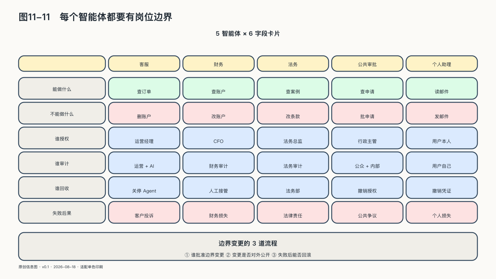

## 每个智能体都要有岗位边界

新员工入职，门卡进不了财务室，离职当天回收；智能体接入生产系统，拿到的却常是一个共享账号和一串永不过期的密钥——它看起来像软件，人们忘了它正代表某个人或某个责任中心行动。

截至二〇二六年二月，NIST国家网络安全卓越中心发布的智能体身份与授权概念文件，把识别、授权、审计、不可抵赖和提示注入防护纳入同一框架。文件仍是概念性项目，但至少说明：智能体不能只靠模型名称获得信任。[^p11-agent-identity]

能进入生产环境的智能体，至少有六项岗位边界：唯一身份，明确委托人，允许使用的工具和数据，任务级预算与有效期，需要人工批准的动作，以及任务结束后的凭证和清理规则。

边界跟随任务变化。采购智能体可以读取合格供应商清单，不代表能查看员工医疗记录；可以生成询价，不代表能自行付款。模型和提示词都会更新，身份系统必须知道当前运行的是哪个版本、带着谁的授权。

智能体协作时，权限不随任务转交自动复制全部，而随委托逐级收窄。任务契约与执行凭证成为机器岗位制度，让目标来源、每步操作、数据工具使用和人工批准都能沿委托链还原。机器承担的工作再多，也不能成为组织里唯一没有岗位说明、没有预算上限、也没有直接责任人的“超级员工”。
