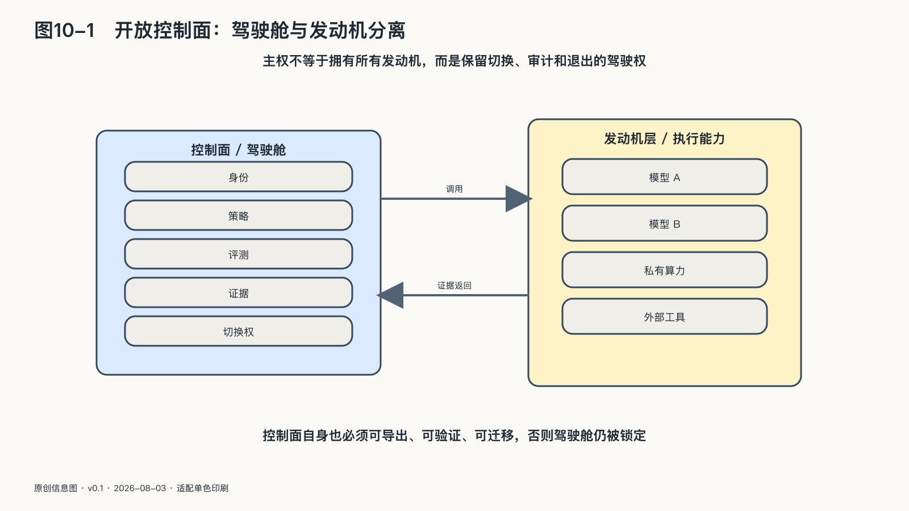

## 协议如何分配控制权

AI离开对话框以后，智能体会代表个人、组织、企业和政府寻找信息、调用工具、交换资料、安排资源。它们怎样确认身份、请求权限、理解对方的字段、记录行动和结算费用，往往由底层协议决定。协议虽然写在工程底层，分配的却是进入系统、取得权限和留下证据的权力。

想象两个智能体需要协助你预约医生。它们至少要解决五件事。

第一是找到彼此：哪一个地址代表真实医院，服务具有什么能力。第二是确认身份：谁在代表你，凭证由谁签发。第三是表达权限：它可以查看哪些资料，权限持续多久，能否继续转交。第四是理解语义：双方说的“紧急”“联系人”“既往史”是不是同一含义。第五是留下证据：谁在何时请求了什么，医院返回了什么，预约为何改变。

如果发现机制被一家平台控制，它可以决定谁有资格出现在未来服务网络里；如果身份只能由一家企业签发，它接近掌握智能世界的通行证；如果授权只有“全部同意”，隐私只能事后补救；如果日志格式封闭，责任会消失在接口之间。

默认值尤其重要。协议若默认把全部历史交给每一个新工具，用户就要反复收紧权限；若默认最小披露、短期授权和不可转交，扩大使用范围则需要再次批准。多数人不会修改复杂设置，接口的默认选择往往会成为事实规则。

开放协议的价值，是让不同模型、工具和服务能够在共同规则下连接，降低更换和组合成本。一个小团队不必分别与每个大型平台谈一套私有接口，用户也不必为了换模型而重建全部工作流。

文档可以下载，只完成了开放的一小部分。协议还要能被不同规模的参与者实现，关键扩展不能被少数企业独占，治理过程应允许新成员发声，兼容性测试要公开，安全成本也不能高到只有巨头承担得起。否则，形式开放仍可能形成事实控制。

协议会分配控制权，并不意味着所有技术细节都要进入公共辩论。但在涉及身份、授权和基础连接的地方，需要公开关键默认值、治理程序和变更方式，使参与者能够评估其后果。

许多治理边界未必先以法律条文出现，可能先藏在一个接口是否允许撤销授权、一条日志是否记录代理关系、一个字段能否表达“不得用于训练”之中。

### 开放控制面：让驾驶舱不被发动机锁住

复杂AI系统里，最难替换的未必是模型。一家机构可以把模型A改成模型B，却发现身份、工具、权限、路由、日志和评测全部绑在原有平台上。这像换掉一辆车的发动机，却发现方向盘、刹车、钥匙和仪表盘只认原厂。

控制面就是这套“驾驶舱”。它不直接生成每个答案，而是决定哪个任务去哪个模型，智能体以什么身份调用哪个工具，什么行动需要确认，什么异常会触发暂停，哪些记录可以在事后还原过程。如果它只能与一家模型、一种工具目录和一套日志合作，应用层看起来再繁荣，底下仍然只有一条路。

“开放控制面”不是要求把所有管理权向互联网公开，更不是把密钥、个人数据和安全策略写进公开仓库。它指向的是另一种开放：连接和记录方式有可实现的规范，身份与权限能在不同实现间表达，配置与历史能够导出，一家供应商退出后，另一套系统还能理解原来的运行边界。

现实中的规范已开始向这个方向走。MCP把模型如何发现和调用工具写成可实现的协议，同时明确提醒客户端，工具对自己行为的描述不能自动当成可信事实；授权规范则要求令牌与预期服务绑定，禁止把上游令牌不加分辨地向下传递。[^p9-mcp-control] OpenTelemetry的生成式AI语义规范，则尝试统一表达智能体调用、模型交互和工具执行等运行轨迹。[^p9-otel-control]

这些规范仍在演进，也不应被误解为一套已经完成的“全球AI操作系统”。相同的字段不保证各方对风险的理解相同，能导出日志也不保证日志完整，同一协议更可能被安全或危险地实现。开放控制面带来的首要价值，是让系统之间有可比较、可替换、可组合的接缝，而不是为任何一种实现颁发安全证书。

这个接缝还必须经过切换才能被证明。一个团队可以让少量低风险任务同时经过两个模型或两套工具服务，比较它们对身份、权限、错误和日志的理解。目标不是追求每一个输出逐字相同。模型本来就可能给出不同表达，不同系统也会有功能差异。需要保持的，是更稳定的运行意义：只读任务不会在换路后获得写入权，已撤销的身份不会在新系统复活，需要人工确认的动作不会因为接口差异自动通过，过去的行动也不会在新日志中失去来源。

如果规范只在设计图上支持替换，真实工作一切换就丢掉权限、历史或责任，开放控制面仍然只是一个未被现实验收的承诺。

### 互操作需要保留多种实现

互操作常被理解为“大家都使用同一种技术”。这既不现实，也不一定健康。

互操作不只要求系统能够连接，还要求它们交换并使用信息，同时保留各自的内部设计。铁路可以由不同公司运营，但轨距、信号和票务需要足够协调；不同银行有自己的系统，转账协议却让资金跨机构流动。

数字系统的互操作至少有四层：网络连得上，文件和字段读得出，双方对含义听得懂，权限、责任、用途和法律条件还能跟着数据一起被正确执行。许多“数据已开放”只完成了前两层。

一所医院可以导出患者记录，但另一所医院不知道代码含义；企业能下载对话，却没有消息之间的关系和工具调用；平台给出标准格式，却没有导出权限、版本和工作流。数据移动了，功能没有恢复。

欧盟《数据法》从二〇二五年九月起适用，其中一项重点是降低云和边缘服务切换的障碍。它要求相关服务满足促进互操作和切换的最低条件，平台与软件服务提供开放接口，并至少以通用、机器可读格式导出相关数据；数据空间参与者也要公开数据结构、格式和词汇等信息。[^p9-data-act]

一部法规不会自动消除迁移困难，但它说明“可以离开”正在从产品善意变成基础市场规则。

通用接口也会提供共同的攻击入口，统一语义还可能加快错误的跨系统传播。开放连接需要与身份、权限、验证、速率限制和撤销机制一起设计。

这里存在一个系统设计权衡：差异过大会提高连接和验证成本，过度同质化又会放大共同故障。互操作的目标，是在身份、语义、授权和记录等连接层形成稳定规则，同时允许内部实现保持差异，从而兼顾协作与替代。

### 规范要在不同实现之间证明自己

把一份接口文档放到网上，只是开放规范的起点。如果只有原开发者能够正确实现，所有兼容性判定都由它完成，关键扩展也要等它批准，那么其他人得到的可能只是一张公开说明书，而不是平等实现协议的能力。

互联网标准化提供了一个可参照的尺度。IETF的RFC 2026把开放与公平、清晰文档、事先实现和测试放在一起；一项规范要获得更成熟的标准地位，需要有来自不同代码库的独立实现完成互操作，并积累实际运行经验。[^p9-ietf-process] 规范除了由发布者说明，还要让其他团队按文档建出不同系统，并在真实环境中完成互操作。

这一要求对AI协议尤其重要。智能体协议会传递工具能力、授权范围和行动结果。一个模糊字段在聊天系统里可能只造成一次解析错误，在工具网络里却可能让一个“只读查询”被另一端理解为“允许更新”。不同实现之间的对照测试、异常输入和版本兼容性，应当纳入规范形成过程。

开放治理同样要经受这个检验。一个基金会可以称自己中立，一份章程也可以允许任何人提交意见；需要观察的是，不同规模的参与者能否进入讨论，不同意见如何留下记录，安全事故是否会改变规范，原始贡献者失去兴趣后项目能否继续。Linux Foundation成立Agentic AI Foundation并接收MCP、goose和AGENTS.md等初始项目，提供了一个值得持续观察的中立治理实验；基金会名称可以说明治理意图，未来的参与、实现和权力交接才能说明它是否成功。[^p9-aaif-governance]

开放标准的意义，不是让世界永远停在同一个协议上。它要让参与者今天可以协作，明天发现更好方法时也有权提出、验证和更换。能够修订的共同规则，比由一家企业永久保证的“完美接口”更接近协同主权。
