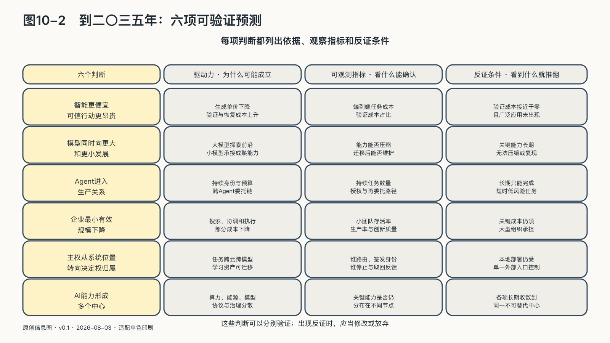

## 到二〇三五年：六项可验证预测

某个模型明年有多少参数、哪家公司暂时领先、哪项基准又被刷新，通常很快过期。时间拉到二〇三五年，更适合观察成本、组织和控制关系有没有发生持续变化。

下面六项预测都附有修正条件。二〇三五年只是观察窗口，不代表技术会按这个日期抵达某个终点。

### 第一，智能会变得便宜，可信行动会变得昂贵

生成一段可用文字、代码或图像的成本还会下降，越来越多基础能力会像搜索、存储和网络一样成为普通投入。与此同时，推理、视频和长任务可能消耗远多于简单问答的能源；一项由Agent完成的工作还要支付身份、数据、工具、验证、保险和失败恢复成本。[^p1-inference-cost][^p6-ai-demand]

生成答案会越来越便宜，证明任务在正确权限下完成仍要付出身份、验证、保险和恢复成本。若模型成本下降却没有带来更广泛使用，或者真实任务的验证成本也降到接近于零，这项预测就应修正。

### 第二，模型会同时向更大和更小发展，领先将越来越阶段化

前沿系统会继续用更大的计算、数据和实验探索未知能力；已经被证明的部分能力，又会通过算法改进、蒸馏、量化和专用化进入更小、更便宜、更接近现场的模型。大模型抬高能力天花板，小模型降低部署地板，两条路线会互相推动，而不是只剩一条。[^p2-two-frontiers]

截至二〇二六年，这个判断已经不再只是抽象趋势：Kimi K3与DeepSeek V4把超大专家池、稀疏激活和长上下文推向前沿，Qwen3、Gemma和各种蒸馏、端侧模型则把能力拆成更低成本的语言、语音、视觉和工具动作。未来应观察的不是谁的总参数最大，而是哪些能力能够在不丢失验证、许可和安全边界的情况下被压缩、迁移并长期维护。[^p2-frontier-models-2026][^p2-small-model-family-2026]

后来者可以吸收公开论文、人才、工具和教师输出，缩短部分差距；先行者也可能凭训练设施、真实反馈、产品网络和持续实验再次拉开距离。长期优势更可能来自持续研发和吸收能力，而不是某一代模型。如果关键能力长期无法压缩、迁移或被后来者复现，阶段性领先的预测就要减弱。

### 第三，Agent将取得持续的任务身份和预算

今天的Agent主要替人搜索、写作和操作软件。下一步，它们会更持续地安排任务、调用专业服务、协商时间、管理预算并把工作转交给其他Agent。METR对前沿智能体的测量已经开始用“人类专家需要多长时间完成同一任务”描述能力边界，而不只测一道题答得对不对；研究者也明确提醒，这类时间跨度不能直接外推为自动化全部工作。[^p9-agent-horizon]

当机器获得持续身份、预算和委托链，组织需要为这种机器代理单独设置权限和责任记录。法律主体未必增加，委托关系会增加。AgenticOps要规定谁能代表谁、授权怎样传递、机器可以把什么再委托出去，以及出现损失时证据回到哪里。若Agent长期只能完成短暂、低风险且必须逐步人工确认的任务，这项变化会比预期缓慢。

### 第四，企业的最小有效规模会下降，组织将同时变得更大和更小

AI不会简单消灭公司。它会重新计算哪些能力必须固定放在公司内部，哪些可以由Agent、软件服务和外部专业网络按任务取得。科斯用交易成本解释企业边界；当搜索、表达、协调、执行和监督中的一部分成本下降，一个人或极小团队就可能组织过去需要多个岗位才能完成的生产。OPC是这种变化最清楚的实验场，而不是它唯一的形式。[^p4-opc-mechanism][^p4-opc-signal]

组织也不会只朝小型化发展。训练设施、芯片、能源、云、支付和全球分发仍有强烈规模经济，甚至可能更加集中。少数大型基础设施组织可能提供通用能力，更多微型生产单元贴近行业、语言和客户，中间由协议、市场、公共底座和专业网络连接。

衡量一国AI实力时，除了头部实验室和算力集群，还要看普通人和小团队取得模型、数据、工具与市场的成本，以及他们能否把一次任务变成自己的产品、评测和客户关系。若到二〇三五年，单人和极小团队的存活率、生产率与创新质量没有改善，协调、获客、核验和责任成本仍必须依靠大型内部组织承担，最小有效规模下降的判断就应修正。

### 第五，部署地点之外，运行控制会成为主要指标

数据中心位置、模型来源和资产所有权仍然重要，但它们不足以描述一个不断路由、调用和学习的AI系统。未来更关键的界线是：谁定义任务，谁签发身份，数据在什么条件下进入，哪个模型被选择，什么反馈成为经验，运行产生的数据集、Agent和工具归谁继续使用，谁能看见行动轨迹，以及谁拥有停止权。

一个国家可以使用全球最先进的外部模型，同时保有数据、评测、公共授权、学习资产和替代路线；也可能拥有本地服务器和模型，却把任务入口、软件更新、身份体系和运行反馈交给单一外部控制点。到那时，“主权化”不会主要表现为一份采购清单，而会表现为跨模型、跨云和跨机构仍然有效的生产、控制与资产沉淀体系。

### 第六，AI能力会分布在多个不对称中心

算力、能源、芯片、开放模型、语言数据、应用市场、技术标准和公共合法性目前分布在不同国家和区域。有的探索前沿，有的提供能源和基础设施，有的建设开放模型，有的掌握应用场景，有的形成区域语言与治理规则。这种分工如果持续，AI产业会保持多个力量不等、彼此依赖的中心。

开源会在这个秩序中扮演接近公共基础设施的角色，但不会消灭封闭服务。它更可能提供共同底座、学习材料和退出路线，使任何中心都更难永久封闭全部能力。WAICO、联合国机制和区域合作的历史意义，也不应按签约人口衡量，而要看原本只能购买智能的国家，能否开始训练人才、修改系统、提出标准并保有运行能力。[^p7-waico][^p9-un-dialogue]

如果未来十年，前沿能力、算力、协议、应用和治理权稳定收敛到同一个不可替代的中心，多中心预测就会失败。若领先位置继续变化，则应观察各国能否吸收外部技术、形成内部学习并参与修改共同规则。

六项预测可以分别验证，不需要合成一个必然结论。到二〇三五年，应至少能够比较：智能成本与验证成本是否分化，大小模型是否继续并存且领先持续易位，Agent是否取得持续的任务身份和预算，企业最小有效规模是否下降，运行控制是否比部署地点更受重视，以及全球AI能力是否仍分布在多个中心。
