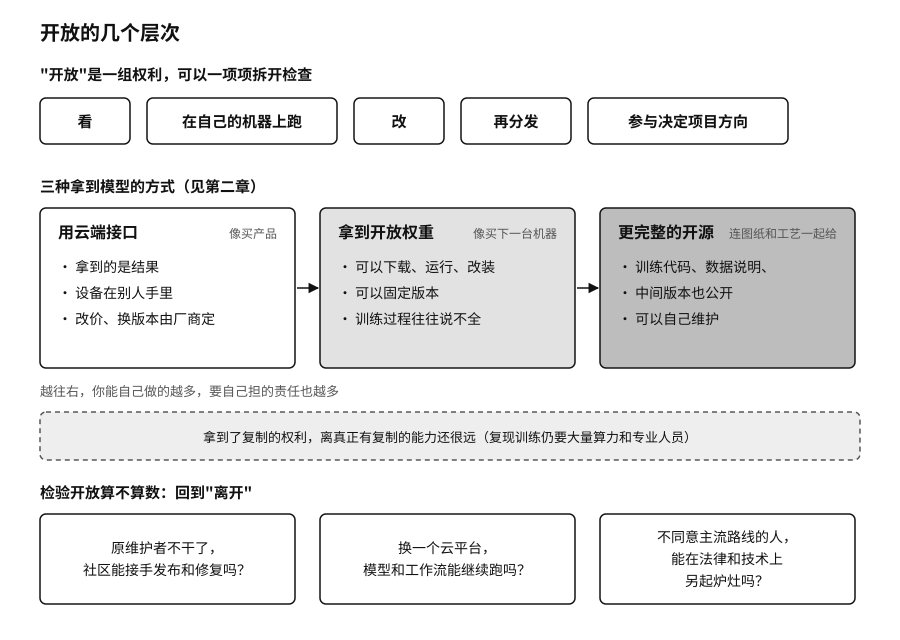

## 开放的代价

改变依赖条件最直接的办法是开放。序章讲过黄仁勋在 X 上转发的那封开放权重联名信，第二章也讲过“开放”其实是一组权利：能不能看，能不能在自己的机器上跑，能不能改，能不能再分发，能不能参与决定项目往哪走。开放源代码促进会（OSI）的《开源 AI 定义》和 Linux 基金会的模型开放框架，都把这些权利一项项拆开来检查。[^p10-open-definitions]

二〇二四年，艾伦人工智能研究所（Ai2，美国一家非营利 AI 研究机构）发布 OLMo 模型时，连训练数据、训练代码、中间检查点（训练过程中定期保存的模型存档）和训练日志一起公开了。[^p10-olmo] 这差不多是开放能做到的上限。即便如此，复现它的训练仍要大量算力和专业人员。拿到了复制的权利，离真正有复制的能力还很远。

开放也把一部分责任从服务商转到了使用者身上。下载一个模型，接进来的是一整条供应链：有的模型文件格式在加载时就能执行代码，加载过程还会调用各种外部依赖。研究者已经在公开模型仓库里系统地测到过恶意代码，Hugging Face 自己的文档也承认平台扫描不能保证发现所有恶意文件。[^p10-model-supply-chain] 所以下载模型要像接收一段陌生程序：核对发布者和许可证，固定版本和哈希值（由文件内容算出的“指纹”，文件改动一个字节它就会变），先在隔离环境里加载。

开放的项目还需要有人养。二〇二四年，开源压缩工具 xz Utils 被人植入后门。攻击者花了两年多时间取得了疲惫维护者的信任，把恶意代码混进了正式发布包，差一点进入主流 Linux 发行版。最后发现它的，是一位微软工程师，他注意到登录时多出了半秒延迟。[^p10-xz] 代码是公开的，可公开的代码不一定有人在看。早在二〇一四年 Heartbleed 漏洞之后，Linux 基金会就开始资助那些被大量依赖却没人出钱维护的基础组件。[^p10-open-governance]

开放也常常走偏。一是开放变成新的入口垄断，权重可以随便下载，版本目录、身份、计费却被少数平台收拢，退出的代价换了个地方继续存在。二是合规负担一路压给每个发布者，中小团队应付不来，开源生态反而只剩下有法务部的大公司。三是开源变成公关，发布时声势很大，半年后仓库再没人更新。

序章提到，英伟达在二〇二六年九月宣布收购 Hugging Face，并承诺平台保持开放、不绑定自家芯片。[^new-nvidia-hf] 这个承诺兑现得怎样，要看几年以后开发者在这个平台上换云、换芯片、换推理服务，是不是还和今天一样容易。

检验开放最可靠的办法，还是回到“离开”。原维护者不干了，社区能不能接手发布和修复？换一个云平台，同一个模型和工作流能不能继续跑？不同意主流路线的人，能不能在法律和技术上都可行地另起炉灶？这几件事做得到，开放才算数。

