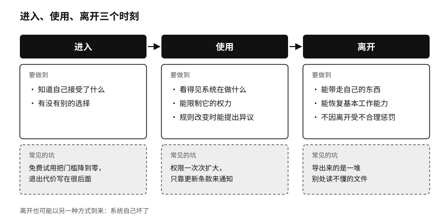

## 进入、使用、退出：技术关系的三个时刻

经济学家阿尔伯特·赫希曼（Albert Hirschman）在一九七〇年写过一本小书，讲组织变坏的时候，人有两种反应：一种是离开，换一家店、换一个工作；一种是留下来发声，抱怨、投诉、要求改变。两种办法互相撑腰。走不了的人更需要申诉的渠道；可以走的人，如果一走就丢掉全部积累，说话也就没有分量。[^p9-exit-voice]

赫希曼那个年代，离开意味着搬家或换供应商。今天的离开变成了一组可以在线完成的操作：吊销一个授权，导出一批数据，把工作流切到另一套系统上。操作看起来简单，真正难带走的东西藏在底下，比如跟系统磨合出来的习惯、团队已经不再练习的手艺，还有只在某个平台里才读得懂的组织记忆。这些东西平时看不见，要等到真想走的那天才浮上来。

我们判断一段技术关系是否健康，会看三个时刻。

进入的时候，要知道自己接受了什么，有没有别的选择。免费试用把第一次的门槛降到了零，退出的代价却常常写在很后面。

使用的时候，要能看见系统在做什么，能限制它的权力，重要规则改变时能提出异议。系统一次次扩大权限，只靠更新一份冗长的条款来通知用户，形式上每一步都经过了同意，双方却越来越不对等。

离开的时候，要能带走自己的东西，恢复基本的工作能力，不因为离开受到不合理的惩罚。导出来的只是一堆别处读不懂的文件，迁移的权利就只停留在纸面上。

离开也会以另一种方式到来：系统自己坏了。复杂系统总会出错，有人想靠把墙垒得更高来避免出错，我们更关心墙后面还剩下多少余地。二〇二六年的《国际 AI 安全报告》汇集了上百位专家的研究，结论是现有方法能降低智能体出错的频率，却还降不到许多高风险场合要求的水平，能做的是层层设防：测试评估、技术防护和监测、事故报告，再加上社会层面的恢复能力，每一层都有漏洞，叠在一起才管用。[^p9-safety-report]

设防之前，先要回答一个问题：哪些事情必须继续。医院停电时可以暂停分析系统，确认病人身份、执行医嘱却一刻不能停；企业的主模型断了，可以少做一些自动化，订单、客户授权和人工接手的能力必须还在。工程上把这叫作优雅降级，系统失去一部分能力时，退回到一个事先想好的简单状态。智能时代尤其要留着一种“低智能模式”，模型不可用或者输出不可信的时候，流程能退回清晰的规则、人工队列或只读状态。所有流程都为自动化重写过，人员也早已不练基本操作，备用方案就像一辆多年没发动过的消防车。

序章里的 Hugging Face 事故留下了一条很实际的教训：防守方要在出事之前，就准备好一个验证过、能在本地运行的模型。事故当天才去找，商业接口很可能因为安全规则拒绝处理攻击数据，那时再部署、再测试已经来不及了。

再买一套一模一样的系统，也未必能多一条退路。两套系统如果用同一朵云、同一个身份系统、同一个模型接口，同一支运维团队，那只是在架构图上把同一个弱点画了两遍。演练的价值就在这里，它能把图纸上看不见的共同依赖逼出来。
