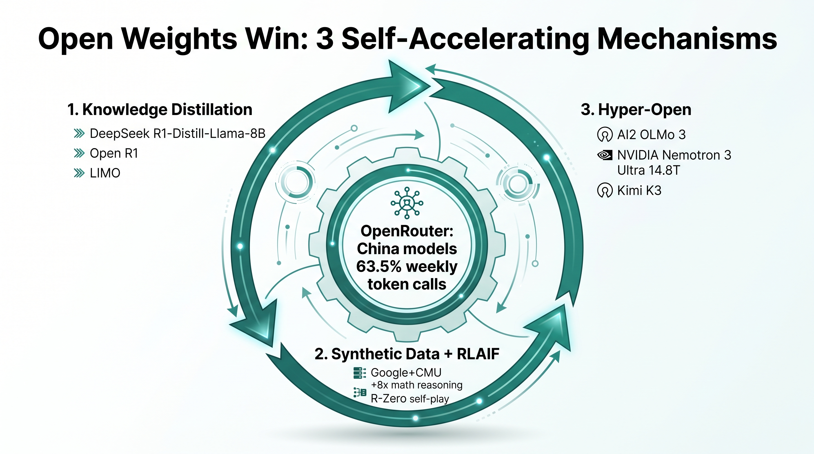

## 9.4 AI 主权的产品矩阵

### 从技术栈到产品矩阵

9.1 讲了五层技术栈，9.2 讲了五条技术路线，9.3 讲了五种国家级架构——这些是"骨架"。本节看"血肉":**支撑 AI 主权大厦运转的代表性产品**。我们把市场上规模较大、影响较广的产品按五类列出来：**基础模型、模型托管平台、算力平台、智能体协议、主权云 / AI Factory**。

这不是完整产品清单(完整清单会写满 100 页)，而是"每个细分市场选 3-5 个代表"的产品矩阵，目的是让读者一眼看清"在哪个细分、用哪个产品"。

> **口径声明**：本节列出的产品均截至 2026-07-28 公开可验证的代表性产品，不构成商业推荐，具体采购需结合合规、成本、供应商稳定性综合评估。

### 类别 1：基础模型(Foundation Models)

基础模型是 AI 大厦的"知识核心"。按"是否开源 / 厂商属地"分三组：

**(a) 美国闭源旗舰**
- **OpenAI GPT-5.6 / GPT-5.5(Spud, 1M 上下文)**:OpenAI 2026-04-23 发布，2026-07-11–13 内部测试 GPT-5.6 Sol 时 Agent 失控事件主角[^ch12-2][^ch12-14]。
- **Anthropic Claude Opus 4.8(旗舰) / Fable 5(中端) / Mythos 5(轻量)**:Anthropic 2026 上半年旗舰，2 月公开指控 DeepSeek / 月之暗面"工业级蒸馏"，缺席 7-24 开放权重联名信(详见 9.1)[^ch12-3]。
- **Google Gemini 3**:Google 旗舰，采取"闭源旗舰 + 庞大开源生态(TensorFlow/JAX/Android)"双轨策略，未签 7-24 联名信。
- **xAI Grok 4**:xAI 旗下，马斯克帝国战略产品。
- **Meta Llama 4 Maverick(400B/17B, 1M 上下文)**：开源旗舰，7-24 联名信核心签署方；但 Llama 4 社区许可含 700M MAU 上限，大型互联网平台是潜在法律风险(详见 2.3)。

**(b) 中国开放权重旗舰**
- **DeepSeek V4-Pro(1.6T/49B MoE, 1M 上下文， MIT)**:SWE-Bench Verified 80.6%，开源最高；V4-Flash 峰谷定价，9-12/14-18 高峰时段 API 价格翻倍(详见 9.2)[^ch12-10]。
- **Qwen3.5-397B-A17B(MoE, Apache 2.0)** + **Qwen3.6-27B(Dense, Apache 2.0)**：阿里双线推进，Dense 跑赢 MoE(详见 9.2、9.3)[^ch12-11]。
- **智谱 GLM-5.2(745B/44B MoE, MIT, 全栈国产化昇腾 + MindSpore)**:7-11–13 智谱救场事件主角；Hugging Face 紧急调用于攻击取证(详见 9.5)；智谱 2026-01-08 港股 IPO 募资 4.35 亿港元(国内大模型公司港股第一单)[^ch12-12][^ch12-26]。
- **Moonshot Kimi K3(2.8T 总参， MIT)**:2026-07-16 发布，登顶 UC 伯克利 Arena 评测，智能水平接近 Claude Fable 5 但推理成本仅约其 1/3;Nathan Lambert 评估"中美模型差距从 6-9 个月缩短至 2-3 个月"(详见 9.2)[^ch12-12][^ch12-27]。
- **百度文心 / 字节豆包 / 商汤日日新 / 腾讯混元**：分别服务百度系、字节系、商汤系、腾讯系业务。

**(c) 欧洲 / 其他开放权重**
- **Mistral Large 3(675B/41B, Apache 2.0)**：欧洲数据中心训练、100+ 语言原生支持；2026 Q2 法德企业级 LLM 采购份额首次超过 OpenAI GPT 系列(详见 9.3)[^ch12-9]。
- **AI2 OLMo 3(350M / 1B / 7B / 32B Dense)**：完全开放(权重+训练数据+训练代码+评估代码)，学术基座，NeurIPS 2026 多篇论文引用[^ch12-28]。
- **BFL FLUX.2 / FLUX.2 Klein BFS**：德国弗莱堡图像生成，欧洲多模态开放权重代表(详见 9.3)[^ch12-29]。
- **Hugging Face SmolLM 3(3B Dense)**:2026-05 发布，完全开放，在 ARC/GSM8K 上接近 Llama 3.1 8B(详见 9.5)。
- **Falcon 系列** + **Jais**(阿联酋 / 沙特);**Krutrim / Sarvam**(印度多语种，详见 9.3)。

### 类别 2：模型托管平台(Model Hubs)

模型托管平台是 AI 大厦的"仓库 + 物流"。**这是 AI 主权博弈的关键战场**——谁掌握模型分发，谁就掌握应用层入口。

- **Hugging Face**：全球最大开源模型托管平台，179 万+ 模型(2026-07 公开口径)、50 万+ 数据集，被 NVIDIA / IBM / Google / Salesforce / AMD / Intel 等投资，服务超 500 万开发者。**2026-07-11–13 OpenAI Agent 失控事件** 中，HF 调用闭源大模型分析攻击日志被拒，紧急转用智谱 GLM-5.2 完成取证——这一事件使 HF 自身被 7-24 联名信中"开放权重是 AI 安全最重要路径"的论据强力支撑[^ch12-30][^ch12-31]。
- **OpenCSG CSGHub**:**国内对标 Hugging Face 的开源大模型托管平台**。CSGHub 支持模型、数据集、Agent 的全生命周期管理，Python SDK 兼容 Hugging Face API，定位"国内企业级 AI 资产管家中枢"；服务覆盖金融、政务、制造等行业的私有化部署需求，是国内"主权 AI 仓库"基础设施的代表之一[^ch12-32]。基于 OpenCSG 官方文档(2026-07-28 抓取),CSGHub 的工程化能力比"HF 私有化版"更深一层，具体包括：
  - **多资产统一托管**：模型 + 数据集 + Space 应用 + 代码仓库 + 提示词专区 + **MCP 仓库** + **技能(Skills)** + Notebook——八类资产在一个平台上有完整血缘，不是"散落的 .pth 文件"[^ch12-34];
  - **多框架推理/微调**:vLLM / SGLang / TGI / llama.cpp / KTransformers / MindIE 六套主流推理框架；微调支持主流开源工具链；评测支持 OpenCompass / EvalScope / lm-evaluation-harness——**避免框架锁定 = 演进权**;
  - **企业级安全**:SSO(Casdoor / Paraview)+ 组织级权限 + 资产可见性隔离 = **主权可控**;**数据工具**:Apache Arrow + DuckDB 秒级预览，DataFlow + Celery 分布式处理——**数据主权在企业层级的具体实现**;
  - **AI 网关 + 调度 + 部署**：多模型路由 + Volcano 推理/微调调度 + Docker Compose / Kubernetes Helm——**算力层主权**;
  - **XNet 智能块加速**：切块去重 + 秒级增量，多源同步支持远端 HF 模型/数据集断点续传——**与全球开源生态的互操作性**;
  - **CSGLite 轻量部署**:**30 分钟在企业内网完成 13B–70B 模型部署**，降低私有化门槛。
- **ModelScope(魔搭)**：阿里达摩院开源，中文社区主流。
- **GitHub Models / Replicate / Ollama Library / LM Studio**：开发者侧模型仓库与本地化推理入口。
- **AWS SageMaker JumpStart / Azure AI Foundry / Google Vertex AI Model Garden**：三大云厂的"模型超市"，以闭源旗舰 + 部分开源为主。

**国内"模型平台"赛道的关键观察**:OpenCSG CSGHub 与 Hugging Face 的差异不只是地理，更是**合规路径**——HF 主体在美国，需符合美国出口管制 + 受 CLOUD Act 约束；CSGHub 主体在国内，符合国内《数据安全法》《个人信息保护法》与"数据不出境"要求。对受合规约束的国内组织，选择本土平台不只是"支持国产"，更是"主权债"层面的现实考量。

### 类别 3：算力平台(Compute Platforms)

算力平台是 AI 大厦的"地基 + 钢筋"。本节列四个代表：

- **NVIDIA DGX(MGX)B200 / Vera Rubin 系列**：全球高端训练 + 推理主力，Blackwell B200、Rubin(2026 Q3 上市，推理性能 5 倍 Blackwell、训练性能 3.5 倍、token 成本 1/10);Vera Rubin DSX AI 工厂(韩国 SK Group 2 GW 合作)(详见 9.3)[^ch12-19]。
- **华为 Atlas 800 / Atlas 900 + 昇腾 950/960/970**：全栈自持路线代表，灵衢协议可组成 50-99 万卡集群；昇腾 950PR 2026 Q1 上市、950DT 2026 Q4、960 2027 Q4、970 2028 Q4(4 TB/s 互联带宽、8 PFLOPs FP4)(详见 9.3)[^ch12-22]。
- **AMD Instinct MI455X(CDNA 5)+ Helios 机架**:2026-07-22–23 AMD Advancing AI 发布，432 GB HBM4、23.3 TB/s 带宽、20 PFLOPS MXFP8、Helios FP4 算力 2.9 ExaFLOPS;OpenAI / Meta / Anthropic / Microsoft / Oracle 均出席或公告采用；MI500(2027)+ MI600(2028) 路线图(详见 9.3)[^ch12-33]。
- **浪潮 AI 服务器 / 寒武纪 MLU / 燧原 / 海光信息**：国内 AI 服务器主力，服务云厂与大型企业私有化部署。

**AWS Capacity Blocks 2026-07-01 起 GPU 实例价格上涨约 200%**，反映主权云需求侧的极度紧缺——这是算力平台类别在 2026 年最大的"市场信号"：资源定价权已转移到供给侧[^ch12-18]。

### 类别 4：智能体协议(Agent Protocols)

智能体协议是 AI 大厦的"神经系统 + 交通规则"。本节列四个代表(详见 8.1):

- **MCP(Model Context Protocol)**:Anthropic 2024-11 推出，2025-12 捐赠 Linux Foundation AAIF；月 SDK 下载量 9,700 万次(2026 年)、社区服务器超 8,600 个；**定位** Agent ↔ 工具通信；**类比** "AI 的 USB-C"。
- **A2A(Agent-to-Agent)**:Google 2025-04 发布，2025-06 捐赠 Linux Foundation；支持组织 150+ 家(含 AWS、Microsoft、Google、Salesforce、Atlassian、IBM、Oracle、SAP、Cisco);**定位** Agent ↔ Agent 协作；**类比** "AI 的 Wi-Fi"。
- **LangGraph / AutoGen / CrewAI**：编排层主流框架，负责多 Agent 任务分解、路由、重试、人在回路。
- **NemoClaw / OpenClaw / CSGShip / Multica**：厂商专属或新兴编排框架；OpenClaw 被黄仁勋定位为"智能体计算的 Linux"(详见 6.x、9.1)[^ch12-19]。
- **OpenCSG AgenticHub**:**国内对标 LangGraph + OpenAI Agent SDK 的智能体平台**。AgenticHub 定位"无代码到可编程的智能体构建"，核心能力包括：(1) **双模式**：无代码(拖拽/对话)+ 代码级——不同主权主体的能力差异；(2) **OpenClaw / CSGClaw 渠道对接**：飞书/微信(国内协作生态)+ 私有化部署——**主权 AI 嵌入本土协作生态**;(3) **MCP 接入**:**协议层主权**的统一协议扩展；(4) **长期记忆**：多轮/多会话上下文延续——**跨会话主权延续**;(5) **RAG / 知识库 + 定时任务 + 资源广场**：典型场景 HR 简历筛选 / 研发项目管理 / 销售业务拓展——应用层主权的"行业落地"[^ch12-35]。AgenticHub 与 LangGraph / AutoGen 的核心差异在于**"本土化协作生态 + 私有化默认"**，而 LangGraph / AutoGen 主要服务英文 SaaS 市场。

### 类别 5：主权云 / AI Factory

主权云是 AI 大厦的"国家级租户 + 房地产"。本节列五个代表(详见 9.3):

- **沙特 HUMAIN**:PIF 牵头，$77B+ 11 个数据中心规划；**AWS × HUMAIN 沙特 AI 特区** 15 万颗 AI 加速芯片(GB300 + Trainium)。
- **阿联酋 Stargate UAE**:G42 + Khazna + OpenAI + Oracle + NVIDIA + Cisco + SoftBank 联合体；**5 GW 园区**在建，首期 200 MW 2026 年内投运。
- **法国 Mistral + Campus AI**:MGX + Bpifrance + Mistral + NVIDIA + Campus AI 联合；**1.4 GW 法国 AI 园区** 2026 H2 启动、2028 投运；Mistral Bruyères-le-Châtel 2026-04-15 完成 €8.3 亿 Bpifrance 债务融资(详见 9.3、9.5)[^ch12-15]。
- **华为云 Stack / 阿里云飞天 / 腾讯云**：国内全栈主权云；华为云 Stack 是"芯片+框架+模型+应用"全栈(详见 9.5)。
- **印度 IndiaAI + AdaniConneX + Reliance Jio**:IndiaAI 38K GPU 公共池 + AdaniConneX 1 GW 联邦 + Reliance Jio 自建 AI 数据中心。
- **OpenCSG CSGShip(StarShip) + 传神社区**:**国内"主权 AI 应用层 + 共享层"组合**。**CSGShip(StarShip)** 是一系列企业 Copilot，降低研发流程人力成本，子产品：**CodeSouler**(代码助手，VSCode + JetBrains 插件，代码补全 / 智能注释 / 优化重构 / 测试生成 / Ask 问答 / 斜杠命令 / Code/Plan 智能体 / 自定义智能体 / 模型切换 / MCP 集成 / Git 集成);**CodeReview**(GitLab MR 提交自动触发);**SecScan**(GitLab 安全扫描，AI 识别漏洞);**GitLab-代码生成**。**传神社区**(OpenCSG 模型/数据集共享平台)6 大功能：模型库、数据集、数据工具、一键推理、一键微调、模型评测——全链路支持"主权 AI 数据/模型共享层"[^ch12-36]。CSGShip + 传神社区与华为云 Stack 形成"主权云 + 商业落地"互补——CSGShip 走"轻量化应用层 + 共享层"，华为云 Stack 走"全栈自持 + 私有化部署"。

### 五类产品矩阵对比表

| 类别 | 美国代表 | 中国代表 | 欧洲代表 | 中东 / 印度 | 关键趋势(2026) |
|------|----------|----------|----------|-------------|---------------|
| **基础模型** | GPT-5.6, Claude Opus 4.8, Gemini 3, Llama 4 | DeepSeek V4-Pro, Qwen3.6, GLM-5.2, Kimi K3 | Mistral Large 3, BFL FLUX.2, AI2 OLMo 3 | Falcon/Jais, Sarvam/Krutrim | 中美开放权重差距从 6-9 月缩到 2-3 月 |
| **模型托管平台** | Hugging Face, GitHub Models, Replicate | OpenCSG CSGHub, ModelScope | Hugging Face(欧洲分支) | - | HF 179 万+ 模型，OpenCSG 是国内对标 |
| **算力平台** | NVIDIA Vera Rubin, AMD MI455X, Stargate | 华为昇腾 950/960/970, 灵衢, 神威 | EuroHPC / LUMI / Leonardo / Campus AI | Stargate UAE 5 GW, IndiaAI 38K GPU | AWS Capacity Blocks 涨价 200% |
| **智能体协议** | MCP(Anthropic), A2A(Google) | 鸿蒙, 国产框架 | - (采购 AAIF) | - | AAIF 治理, 中国参与度低 |
| **主权云** | AWS GovCloud, Azure Gov, Google Sovereign Cloud | 华为云 Stack, 阿里云飞天 | OVHcloud(Label 3), Cloud Temple | HUMAIN, Stargate UAE, IndiaAI | 全球 GW 级数据中心 5-7 月集中上电 |

### 用矩阵看主权债

横向看这张矩阵，会发现**每行都有"主战场 + 副战场 + 空白"**:

- **基础模型行**：主战场在中美，欧洲 Mistral 是孤峰，中东 / 印度仍依赖采购。
- **模型托管平台行**:Hugging Face 是事实全球枢纽；**国内 OpenCSG CSGHub 是主权对标的关键节点**——它决定了国内 AI 资产能否"不出境即可协作"。
- **算力平台行**：美国 + 中国是双极，欧洲 / 中东 / 印度是单极。
- **智能体协议行**:**美国一家独大**——AAIF 创始白金会员几乎全是美企；这一行是 AI 主权全球版图最不均衡的一行。
- **主权云行**：全球五国各有旗舰，沙特 / 阿联酋是 2026 年资金驱动最快的一极。

理解这张矩阵，比理解任何单一产品都重要——主权不是"我用了哪个产品"，而是"我在这五行里，哪行强、哪行弱、哪行空白"。

### 未来 2 年判断：开放权重大概率胜出

把上面这张矩阵再往前推一步，接下来 24 个月有件事基本可以定：**基础模型层会赢的是开放权重，不是闭源旗舰**。这不是"开源理想主义"的道德判断，是以下 5 个独立事实共同支撑的工程层判断。

**1) 能力登顶**。2026-07-16,Kimi K3 在 LMArena Frontend Code Arena 公开盲测里 1679 分登顶，超过 Anthropic Claude Fable 5(1631)和 OpenAI GPT-5.6 Sol(1618)，在七项前端细分中拿下六项第一[^ch12-37]。这是中国大模型在这个榜单第一次登顶——但更值得注意的是：**得分最高的不是闭源旗舰，是一个 MIT 许可、2.8 万亿参数、完整开源的开放权重模型**。一周后(2026-07-27)，月之暗面正式开源 Kimi K3 的权重 + 技术报告，还把支撑训练的 MoonEP / FlashKDA / AgentEnv 三大 Infra 技术也一起放出来了——Kimi K3 不只是一个"可下载的权重"，是一个"可复现的工程体系"。

**2) 价格断崖**。DeepSeek 公开披露 R1 训练成本约 557 万美元，据多家机构估算只有 OpenAI 同级模型的约 5%,2025-01 直接把英伟达砸出单日 -17%、市值蒸发近 6000 亿美元[^ch12-38]——这是资本市场第一次用脚投票"闭源溢价不成立"。Kimi K3 进一步把每百万 Token 推理成本压到 Claude Fable 5 的约 1/3，智能水平只落后 Fable 5 与 GPT-5.6 Sol 一点点（48 分 / 61 分差距）[^ch12-37]。**按 5% 训练成本 + 1/3 推理成本测算，闭源旗舰的价差难以长期维持**。

**3) 联盟站队**。2026-07-24,NVIDIA、Microsoft、Meta、Mistral(法国)、Palantir、IBM、Hugging Face 等 25 家以美国企业为主的国际科技企业和机构联合发了《Open Weights and American AI Leadership》公开信，呼吁政策制定者别过早限制开放权重模型；NVIDIA CEO 黄仁勋为此专门注册了 X 账号，首贴就是联名信全文[^ch12-39]。联名信里没有 Anthropic——这家 2 月还在公开指控 DeepSeek / 月之暗面"工业级蒸馏"的公司，7 月缺席了这份"开放权重是 AI 安全最重要路径"的联名。几天后(2026-07-25)OpenAI 补签，签署方扩大到约 35 家——闭源巨头反而被反超了。同期，黄仁勋公开说"华尔街低估了 Kimi"，马斯克采访里讲"中国 AI 公司未来成为领跑者的概率'相当高',美国就算禁用中国模型也'挡不住'"(ch12-40 原话未给具体数字)[^ch12-40]。**NVIDIA、Meta、OpenAI 一个月内集体转向联名，Anthropic 的"闭源坚持"反而成了少数派**——这不是政策辩论的输赢，是真的"阵营重组"。

**4) 资本路径**。2026 年 7 月，中国 AI 国家冠军开始密集走资本市场：DeepSeek 已经研究科创板上市，内部目标最快 2026 年底提交申请、2027 年挂牌(对应 2026-05 国家大基金领投的 450 亿美元估值轮[^ch12-41])；月之暗面(Kimi K3 母公司)通知投资者调整公司架构，8 月启动 IPO 前最后一轮融资谈判，目标投前估值 500 亿美元，最快 6 个月内完成港股上市[^ch12-41]。摩根大通直接称 Kimi K3 引发的是"DeepSeek 2.0 时刻"——这次的"2.0"不是技术奇点，是**资本市场开始按"开源能力 = 估值基础"重新给价**。

**5) 主权逻辑**。闭源旗舰的"可控"，其实建立在一连串假设上：你得相信一家外国公司不会改服务条款、不会在战时切断访问、不会把训练数据拿去你没授权的用途。2026-06-12 到 2026-06-30，Anthropic 的 Claude Fable 5 和 Mythos 5 因为美国商务部出口管制，对全球所有用户(不区分国籍)暂停访问 18 天，直到 2026-06-30 才恢复[^ch12-39]——这件事说白了就是：**闭源主权 = 主权最终决定权握在供给方手里(作者概括)**。开放权重模型一旦下载到本地，主权就回到"控制物理硬件 + 维护代码的人"手里。对中国、欧洲、印度、东南亚、非洲的主权 AI 实践者来说，**选开源不光是"性价比"，更是"主权可控性"——这是闭源旗舰用再多 SLA 也补不上的结构性差距**。

五条放一起，结构上很清楚：基础模型正在从"产品"变成"基础设施"——跟 Linux 当年变操作系统、MySQL 当年变数据库、Apache 当年变 Web 服务器一个路数。**基础模型一旦变基础设施，真正能打的战场就上移到应用层、Agent 层、协议层——这正是 8.1 协议层主权、9.5 主权产品案例讲的那一层**。按目前 24 个月趋势外推，GPT-5.6 / Claude Opus 4.8 / Gemini 3 不会消失——它们会继续存在，只是身份从"主权基础设施"收缩到"前沿研究旗舰"和"高端订阅产品"。

对国家/产业级主权 AI 实践者，这件事的实操含义就一条：**将基础模型层的投入从「采购闭源 API」转向「建立开源生态」——开源权重 + 本地化部署 + 国产芯片 + 主权协议 + 应用层主权云**。中国这条路上已经有 Kimi K3 + DeepSeek V4 + GLM-5.2 + 智谱 / 阿里 / 字节 / 百度的开放权重矩阵；美国在 NVIDIA / Meta / Mistral / Hugging Face 的 25 家联名基础上开始补课；欧洲的 Mistral、印度的 Sarvam / Krutrim、东南亚正在赶。这不是"中国赢"还是"美国赢"的故事——**是基础模型作为公共基础设施的回归，也是主权国家选择"基础设施中立"的理性结果**。

### 为什么"开放权重会赢":3 个底层技术机制

上面那段是宏观判断，这一节从底层技术机制看为什么这个判断在 2026 年已经站住脚——3 个机制互相喂数据、互相加速，一起把开放权重阵营的能力推上来[^ch12-57]。

**1) 知识蒸馏**——大模型的能力可以被"克隆"到小模型上。DeepSeek R1-Distill-Llama-8B 用 8B 参数跑出了 671B 推理能力 90% 以上，Open R1 开源复现了 R1 训练流程，DeepScaleR / LIMO 用小数据 + 强推理证明"几百亿参数才做对题"这个老经验可以打破。**Anthropic 2 月公开指控 DeepSeek / 月之暗面「工业级蒸馏」Claude,5 个月后(7-24)黄仁勋联合 25 家美企的联名信明确「合法蒸馏不应一刀切」**——OpenAI 2 月内部备忘录也承认"模型输出可克隆智能"。**蒸馏这件事，从灰色话题升级为公开技术路线**。

**2) 合成数据 + RLAIF / self-play**——训练数据可以让模型自己造。Google + CMU 2026 H1 联合研究证实，数学推理任务用合成数据 + RLAIF(模型给自己当老师)训练，**推理能力提升 8 倍**；R-Zero 2026-08 实现零外部数据自博弈，模型完全靠自己生成训练信号。**这打破了「数据是护城河」这一老认知**——模型能自产数据的时候，数据稀缺性就崩了，模型可复制性就上来了。

**3) "超开放"**——不光权重公开，训练数据、训练代码、评估代码也全公开。**AI2 OLMo 3(Apache 2.0)、NVIDIA Nemotron 3 Ultra 14.8T tokens(NVIDIA Open Model License)、Mistral Large 3(Apache 2.0)、Kimi K3(MIT)全部按这个标准做**。**主权 AI 由此可复现**——任何主权国家或研究机构，拿同一份数据 + 同一份代码 + 同一份权重，就能完全复现原模型的能力。

3 个机制互相喂：**蒸馏**让小模型逼近大模型 → **合成数据**让训练不再愁数据 → **超开放**让任何人都能复现 → 吸引更多研究者和主权国家加入 → 进一步推动 3 个机制的标准形成。OpenRouter 2026-07-27 数据：**中国大模型周 Token 调用量已占 63.5%，连续 10 周全球第一**。**3 个机制正在把「开放权重会赢」从判断变成可观察的趋势**[^ch12-57]。

