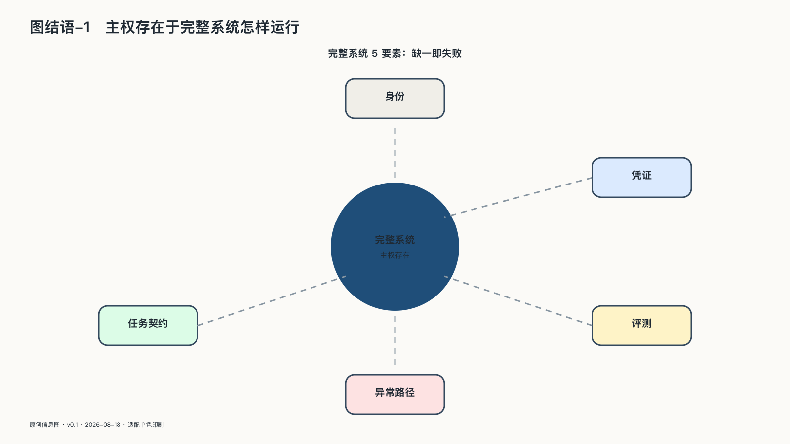

## 主权存在于完整系统怎样运行

第一部看见的是依赖怎样形成：Token在数据中心里被生产，能力走出工厂，扩散到每个人手里。但一个模型走出工厂时，还只是能力的起点——它会不会行动、能触及什么，取决于它被装进了怎样的系统。

同一个模型只生成标题，与它读取病历、筛选求职者、退款、部署代码或取消公共福利，风险完全不同。参数规模无法单独说明后果，必须把系统连接一并考虑。

一个投入使用的AI系统至少包含模型、上下文与记忆、数据、身份与权限、工具、任务状态、评测、日志以及承担责任的人，共同组成一套社会技术系统。

到了Agent阶段，系统处理的是延续数小时甚至数天的任务，而不只是一次次请求。任务会产生子任务、等待批准、失败重试、委托其他能力，并留下现实副作用。治理对象也要从单次模型调用扩大到完整任务。

基础设施不一定体积庞大。只要一种系统被大量主体持续依赖，替换周期变长，失效会沿连接传播，并开始规定其他活动能够怎样进行，它就获得了基础设施性质。

AI正在同时进入认知与行动。它参与社会怎样组织材料、形成选项、解释异常和执行决定。这样的基础设施不能只按功能和价格评价，还要按控制、证据、退出与公共责任评价。

服务器在本地，任务仍可能失控；权重可以下载，组织仍可能没人会维护；合同允许导出数据，换个平台以后，原来的工作流仍可能无法恢复。主权只能在运行中被证明。数据有没有越过边界，权限会不会沿委托链越放越大，高风险动作是否经过批准，模型和工具变化后有没有重新验证，出了问题能不能停止和恢复，这些都要在真实任务里回答。任务结束后，还要看反馈是否进入评测，行业知识是否变成可维护的资产，项目经验有没有留给下一轮建设。

因此，“拥有多少”不能单独衡量主权。一个组织即使没有买下全部设备和模型，只要任务定义、数据边界、身份授权、评测标准、行动记录和替代路径仍由自己掌握，外部能力也能被吸收进长期建设。反过来，服务器、代码和模型文件一应俱全，却无人理解系统、没有备用设备、缺少评测，也限制不了Agent使用账户，资产再多也很难独立行动。

合作可以很深，权力仍需有边界；能力可以来自外部，责任却不能跟着外包。系统无论多复杂，使用者都要留得下改变路线的现实条件——而“留得下”不能靠声明，只能靠一次次真实的检验。
