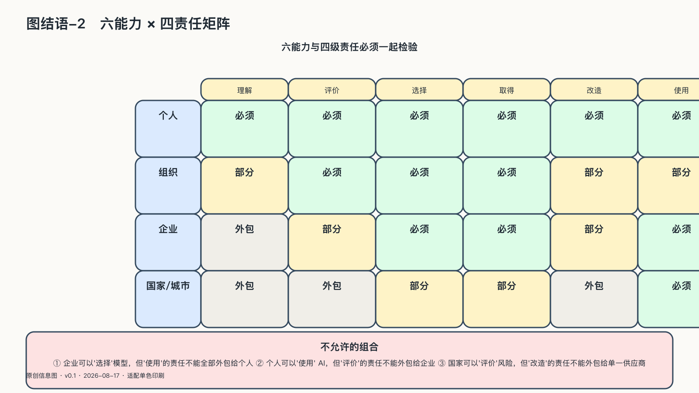

## 六种能力与四个尺度的责任必须一起检验

检验的动作都很具体，缺席时也从最基础的环节开始：

一份合同说"数据归你"，直到导出文件无法打开；一张架构图画着备用模型，直到主服务中断时没人敢切换；一套系统写着"人类最终负责"，直到事故发生后找不到停止按钮。

数据可携带要经过导出与恢复，替代方案要真实切换，重要行动要能够回放，停止和人工接管要提前演练，申诉也要由受影响的人实际走过。写在合同、架构图和制度文件里的权利，如果从未被使用，更像愿望。

当一个普通人被错误系统拒绝服务时，最廉价的解释是"你当初点过同意"；当企业失去供应商时，最廉价的解释是"市场会提供替代"；当公共机构自动作出错误决定时，最廉价的解释是"最后有人点过确认"。这些说法都把责任推给了链条里最弱的一环。

四个尺度上，各有各自不能外包的责任（个人保护意图与记忆；部门守住数据边界；企业承担生产连续性；国家与城市约束公共权力）。一尺度不能替另一尺度守它自己的边界：个人再谨慎修复不了平台，企业合同也代替不了公共授权。每一尺度都要用前文给出的六项能力去检验——选择、替换、迁移、审计、组合、继续演进——缺席任何一项，其余都会慢慢失效。
