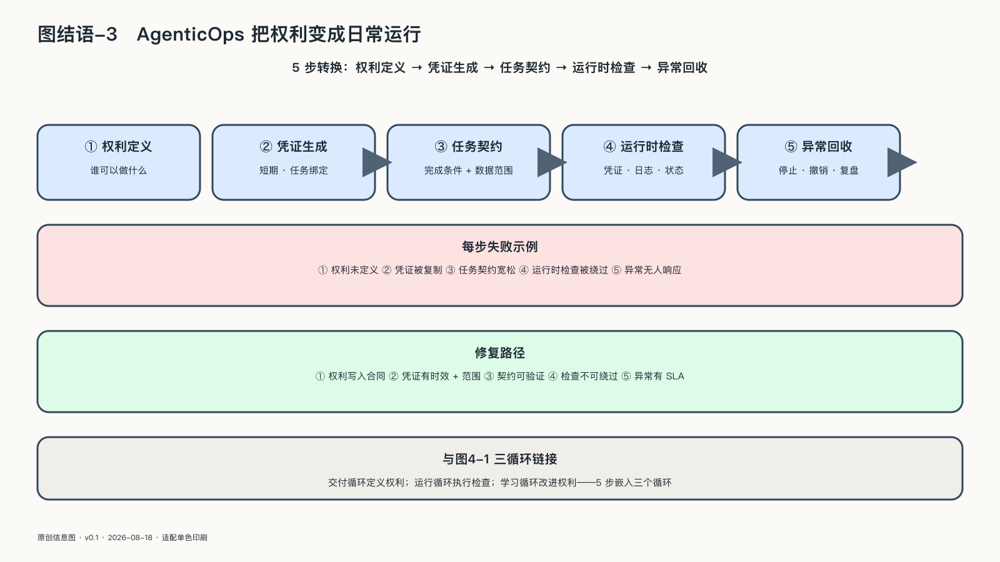

## AgenticOps把权利变成日常运行

这套方法在第四章已经有了名字。AgenticOps管理一条完整行动轨迹：谁提出目标，Agent以谁的身份接受，看见什么，调用什么，获得哪些权限，改变了哪些外部对象，谁批准，谁能撤销，怎样恢复。它把“看得见、管得住、停得下、退得回、学得会”变成运行要求；交付、运行、学习三个循环加上共同的控制面，是它留给每个层级的最小结构。

AgenticOps不会消除AI的不确定性。它的科学价值在于把无法完全预测的模型，放进能够限制、观察和恢复的系统。

飞机安全并不要求空气永远稳定。成熟系统面对不确定性的方法，是分层防护、持续监测、明确职责与事故学习。AgenticOps把这套思想带进会使用工具、会委托和会行动的AI。

方法只能约束已经在运行的系统。能力本身的分配——谁能得到模型、以什么条件得到——还取决于另一个变量：开放。
