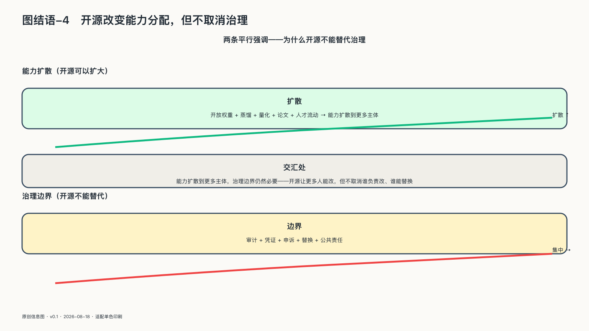

## 开源改变能力分配，但不取消治理

第九章守住的是依赖中的底线——事故后能恢复、控制权可见、证据可查；第十章接着问，能不能改变依赖条件本身。开放，是全书给出的最有力回答。

API让人购买输出，开放权重让人取得训练后的机器，更完整的开源还提供研究、修改和分享所需的材料与权利，为本地部署、独立研究和供应商替换创造条件。

它改变的是能力分配，不是治理责任。下载权重不会自动带来芯片、电力、人才、维护和安全；可见代码不会自动产生审查，共同仓库也不会自行形成健康治理。开放不是一次开关，而是一组权利的组合：判断它的价值，要看使用者获得了哪些具体自由，生态能否长期维护这些自由，事故后谁能修复，以及控制权是否只是从商业平台转移到少数维护者和基础设施提供者。

开放控制面、协议和可迁移资产，可以与付费运营、安全服务和专业支持共存。

模型也会继续向两个方向发展：更大的系统探索能力上限，蒸馏、量化与专用化则把已经验证的能力送进更小、更便宜、更接近现场的模型。

主权因此不能押在某个模型永远第一，也不能押在所有模型终将被完整复制。只要开放底座让单一中心更难永久封闭全部能力，它就已经扩大了持续吸收、独立评测、组合部署和迁移的空间。

但一套理论不能只靠听起来正确来证明自己。
