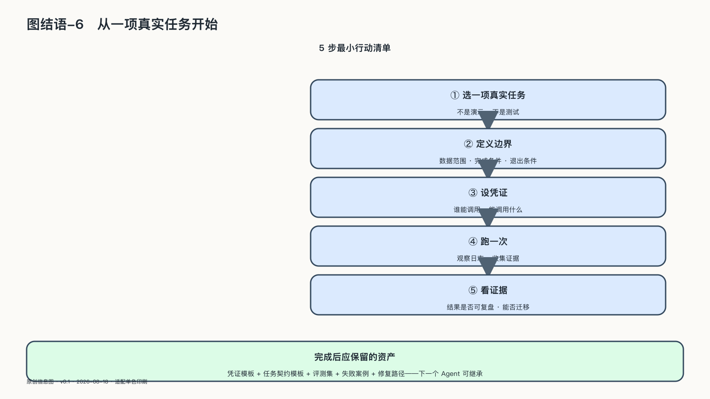

## 从一项真实任务开始

这本书不要求立刻建设一套宏大的“主权系统”，只需要从一项后果重要、已经使用AI的任务开始。

围绕它，做五次实验。

第一次，导出相关数据、提示、知识与任务状态，在原平台之外恢复。

第二次，切换一个模型、工具或服务，记录哪些能力能够继续，哪些专有连接无法迁移。

第三次，回放一次重要行动，检查能否找到目标、来源、版本、权限、批准与外部结果。

第四次，暂停Agent或关键接口，让业务进入降级模式，观察人工是否知道怎样接管。

第五次，邀请会受到系统影响的人提出异议，验证说明、纠正和救济是否能够走通。

今天的产品排名和参数很快会过时。排名的更替从来不是这场分配的记分牌；记分牌在机器行动的整条链上——谁还能设定边界、检查过程、纠正错误。机器承担的步骤越多，替换、审计、降级和人工接管就越不能等到事故发生后再测试。

一项AI服务如果停得下来，数据和任务状态导得出去，重要行动说得清、改得了，使用外部能力并不等于交出全部控制。反过来，这些基本操作都做不到，“自主”写得再漂亮，也只存在于供应商条款里。

人没有必要因为机器更聪明，就把每件事重新抓回自己手里。五次实验所检验的，只是一条很朴素的底线：今天接受这项帮助，不能让明天的选择从此消失。

看见依赖，是为了把主权一级一级建出来；建设主权，是为了在依赖中争取自由；而这一切最终只为一件事——把选择留在自己手里。
